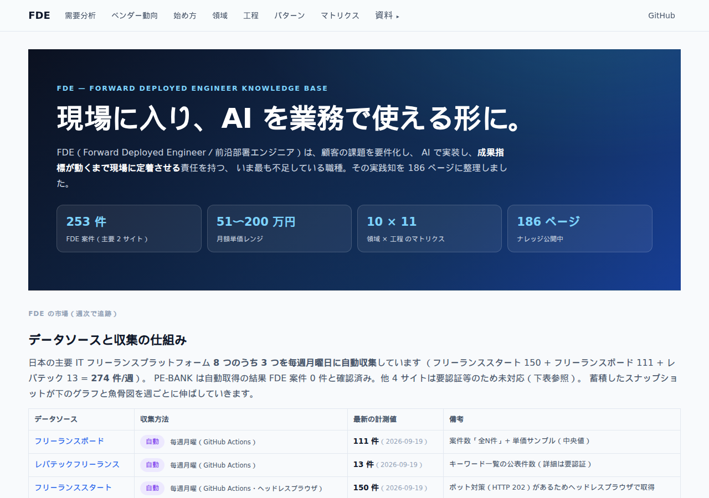
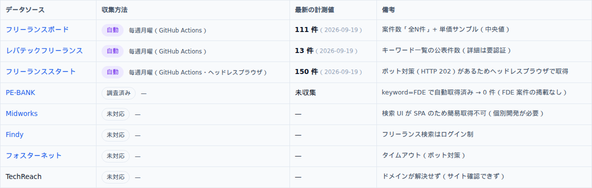
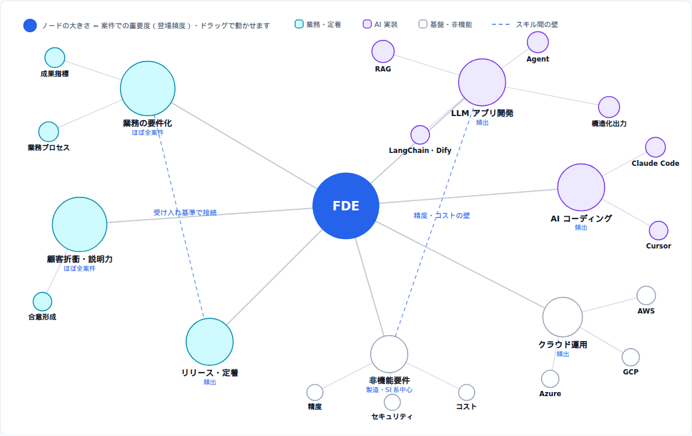
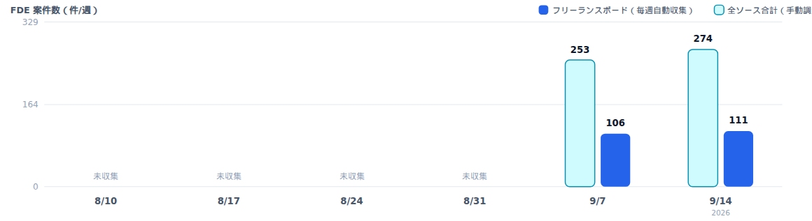
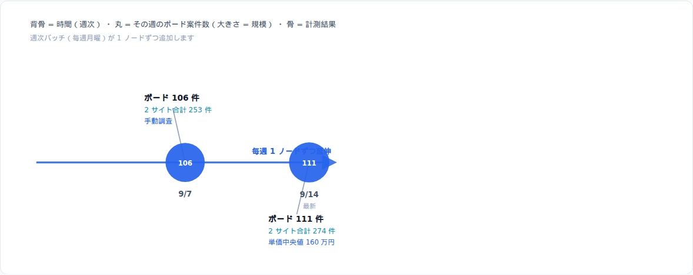
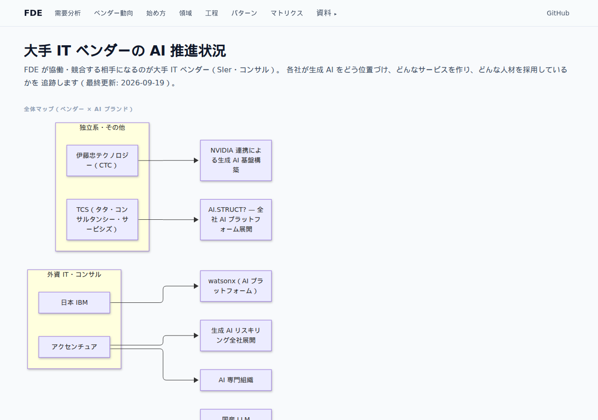
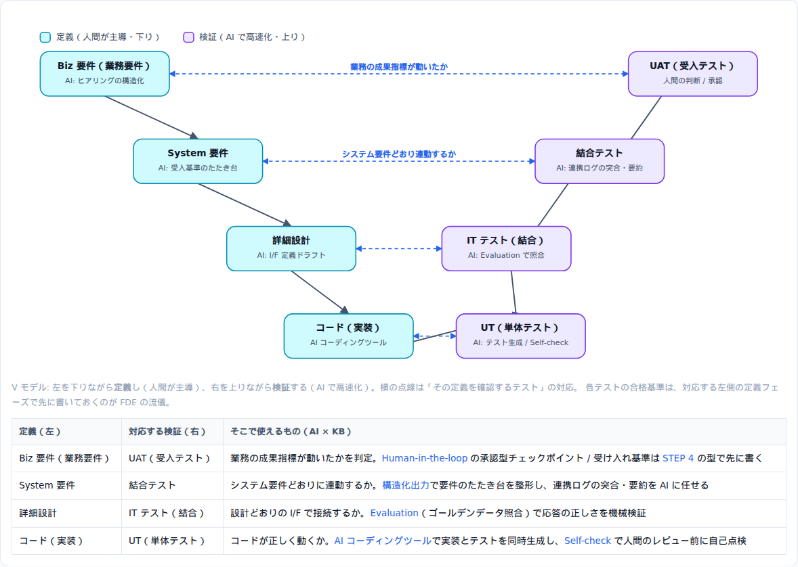
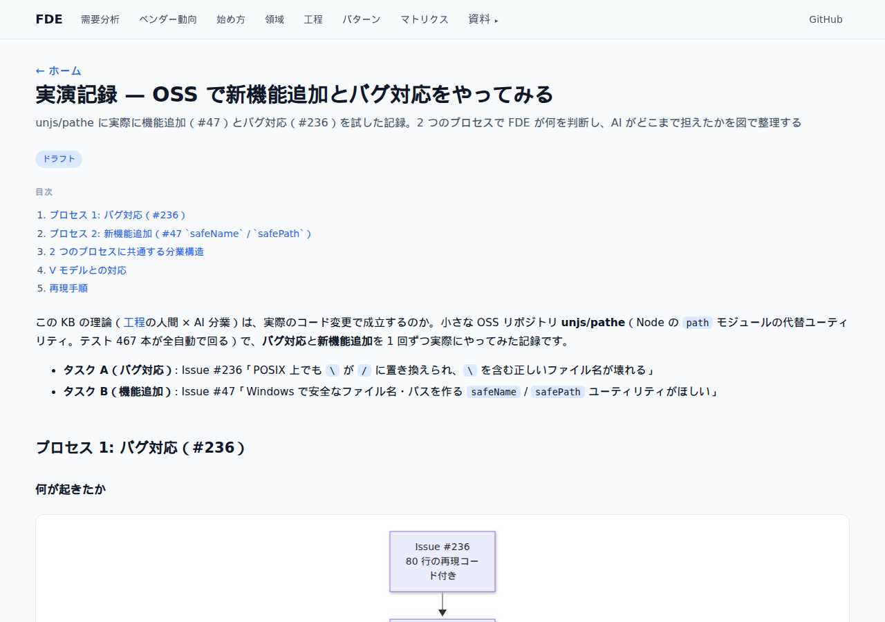

# FDE — Forward Deployed Engineer Knowledge Base

[](https://github.com/zixuniaowu/PDE-AI-Knowledge-Base/actions/workflows/ci.yml)
[](https://github.com/zixuniaowu/PDE-AI-Knowledge-Base/actions/workflows/deploy.yml)


> **FDE（Forward Deployed Engineer／前沿部署エンジニア）** は、顧客・事業部の現場に入り、AI を実際の業務に組み込み、**成果指標が動く状態まで責任を持つエンジニア**。アルゴリズムエンジニアは業務を知らず、業務の専門家は AI を知らない——この断絶を埋める、企業の AI 導入で最も不足している役割です。

**公開サイト**: https://zixuniaowu.github.io/PDE-AI-Knowledge-Base/



## このリポジトリでできること

### 1. FDE 需要の週次ダッシュボード（3 ソース完全自動収集）

主要フリーランスプラットフォーム 3 サイトの FDE 案件を、**毎週月曜に GitHub Actions が自動収集**し、件数・単価を継続追跡します。



フリーランススタートはボット対策（HTTP 202）があるため、ヘッドレスブラウザ（Playwright）で取得——**手動集計は不要**です。

### 2. 案件必須スキルの知識グラフ

週次収集した案件データから抽出。ドラッグで動かせ、クリックで対応ナレッジへ飛べます。



### 3. 需要の推移（魚骨図 + 週次バー）

毎週 1 ノードずつ伸びる魅骨図と、直近 6 週の案件数バーで、市場の趨勄を継続的に可視化します。





### 4. 大手 IT ベンダーの AI 推進マップ

NTT データ・富士通・NEC・日立・IBM・アクセンチュアなど 8 社の AI ブランド・施策・採用動向を追跡（[zixuniaowu/pathe](https://github.com/zixuniaowu/pathe) のように、出典リンク付きで更新）。



### 5. UML 図中心のナレッジ本体

- **工程**: ウォーターフォールは **V モデル図**、アジャイルはループ図で構造を表現
- **パターン 9 型**: RAG・Agent・Human-in-the-loop などを**シーケンス図 / 状態図**で解説
- **始め方 6 ステップ**: 題材選定の決定木、作業ループ図など図で読める



### 6. OSS 実験記録 — 理論の実証

実 OSS（unjs/pathe）で**バグ修正と機能追加を実際に実施**し、「FDE が何を判断し、AI がどこまで担えたか」をシーケンス図に整理した記録。



## アーキテクチャ: Content as Data

```
content/ja/**/*.md + data/*.json ──▶ @pde/content-core（Zod 検証）
        │                                    │
        ▼                                    ▼
  apps/web（Next.js 静的Export）      apps/mobile（Expo）
  → GitHub Pages 自動デプロイ          → 同一データを読むビュー
```

- 追加はテンプレコピーだけ（コード変更不要）。**3 層テスト**（スキーマ検証 / 単体 / E2E + スクリーンショット）で守る
- 検索インデックス・RSS・llms.txt もビルド時に生成

## クイックスタート

```bash
pnpm install
pnpm dev                  # Web（http://localhost:3000）
pnpm validate:content     # コンテンツスキーマ検証
pnpm test                 # content-core ユニットテスト
pnpm build:web            # 静的生成（apps/web/out）
pnpm build:mobile-content # モバイル用 JSON / RSS / llms.txt 生成
pnpm test:e2e             # Playwright E2E（chromium）
pnpm shot                 # スクリーンショット + ランタイムエラー検出
node scripts/collect-market-data.mjs  # 市場データの週次収集
```

## リポジトリ構成

```
content/ja/        # ★ ナレッジ本体（guide / domains / process / patterns / references / intersections）
data/              # 市場スナップショット・ベンダー追跡データ（週次/月次バッチが更新）
apps/web/          # Next.js 14 静的サイト（GitHub Pages）
apps/mobile/       # Expo アプリ（同一データを読む）
packages/content-core/  # コンテンツ読込 + Zod スキーマ
scripts/           # 検証 / 市場データ収集 / スクリーンショット / 静的配信
e2e/               # Playwright（29 テスト：全ページ・図・リンク巡検・RSS）
docs/              # アーキテクチャ・コンテンツモデル・RFC・スクリーンショット
```

## 参加する

- ナレッジ追加は[CONTRIBUTING.md](./CONTRIBUTING.md) → テンプレコピーして Markdown を書くだけ。CODEOWNERS がレビューします
- 新しい領域の提案は[Issue テンプレート](./.github/ISSUE_TEMPLATE/)、設計変更は[RFC](./docs/rfc/) を利用
- 詳細は[docs/architecture.md](./docs/architecture.md)（設計思想）・[docs/content-model.md](./docs/content-model.md)（スキーマ仕様）

## ライセンス

- コード: MIT
- コンテンツ（`content/`, `docs/`）: CC BY 4.0

あなたの FDE 実践の知見を、ぜひここに残してください。
