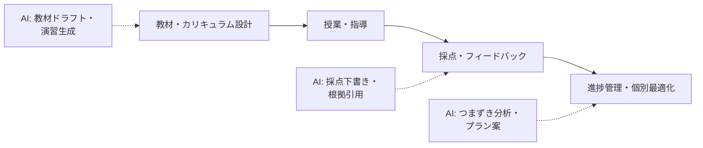

教育領域では、AI を「教師の代替」ではなく「教師と学習者の間に入る支援者」として設計するのが本リポジトリの方針です。

## 業務の全体像

- 教材・カリキュラム設計
- 授業・指導の実施
- 採点・フィードバック
- 学習者の進捗管理と個別最適化
- 保護者・管理者への報告

## AI が効きそうな場面

| 業務 | AI の関わり方 | 人間に残る役割 |
|---|---|---|
| 採点・フィードバック | 採点下書き・個別フィードバック文の生成 | 最終判定、特に合否に関わる採点 |
| 教材作成 | レベル別の説明・例題の生成 | 教育目標との整合確認 |
| 個別最適化 | つまずきパターンの分析と対策案 | 学習者との対話と動機づけ |

## この領域特有の制約

- 学習データは個人情報・要配慮情報になりうる
- 「AI に書かせた宿題」など、学習者側の AI 利用ルールも設計対象
- 誤った説明がそのまま信じられるリスク（ハルシネーション対策は必須）

## ユースケース

- [採点支援ツール（教育）](./use-cases/grading-assistant.md)
- [個別学習プラン生成ツール](./use-cases/individual-learning-plan.md)
- [教材ドラフト生成ツール](./use-cases/lesson-material-draft.md)

## 法規と保存期間（この領域の前提）

| 項目 | 内容 |
|---|---|
| 生成 AI ガイドライン | 文科省「初等中等教育段階における生成 AI の利活用に関するガイドライン」（令和 5 年 7 月制定、令和 6 年 12 月改訂版が現行）。自治体・学校はこれに沿って個別規程を作る |
| 個人情報 | 学校は個人情報保護保護条例（自治体）が管轄。要配慮個人情報（発達・特別支援の記録等）は別扱い |
| 保存期間 | 指導要録・学籍簿は学校教育法施行規則 157 条により卒業後 20 年保存。AI の判定履歴が「学習評価資料」に含まれるかの位置づけを先に決める |
| 正本システム | 成績の正本は校務支援システム。AI ツールは正本への転記・連携方式まで設計しないと二重入力で現場が離脱する |

## AI 導入マップ（業務フロー × AI の掛かる場所）

