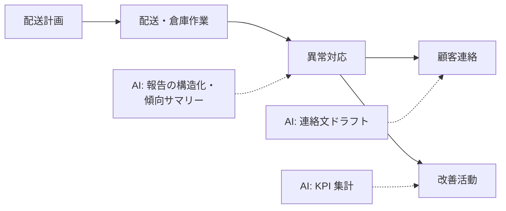

物流は現場（ドライバー・倉庫作業員）と管理の間で情報の粒度が最も落ちやすい領域です。AI は「現場の声 → 構造化データ → 管理の意思決定」の橋渡しに使うのが有効です。

## 業務の全体像

- 配送計画・運行管理
- 倉庫作業（入出庫・ピッキング・在庫）
- 異常対応（遅延・破損・欠品）と顧客連絡
- 改善活動（報告書・KPI 管理）

## AI が効きそうな場面

| 業務 | AI の関わり方 | 人間に残る役割 |
|---|---|---|
| 異常報告 | 自由記述の構造化・傾向整理 | 対応判断・顧客連絡 |
| 指示書 | 作業指示・注意喚起のドラフト | 安全確認・承認 |
| 改善 | 報告の集計・KPI サマリー | 改善施策の決定 |

## この領域特有の制約

- 時間単位で状況が変わる。AI に「現在の状況」を持たせず、常に最新データを渡す
- 安全に関わる指示（荷扱い・運転）の最終確認は人間
- 荷主情報・取引情報の取り扱い（共有範囲のルール化）

## ユースケース

- [配送異常報告の整理と傾向分析](./use-cases/delivery-anomaly.md)

## 法規と保存期間（この領域の前提）

| 項目 | 内容 |
|---|---|
| 運行記録 | 運行管理（貨物自動車運送事業運輸規則）: 運行記録・乗務記録の保存義務。AI の異常整理も輸送安全規程との接続を確認 |
| 品質・事故 | 破損・誤配の記録は荷主への報告義務・補償契約と接続。対象期間は契約ごとに確認 |
| 正本システム | 配車システム・WMS が正本。AI は正本からデータを受け取り、報告書は荷主提出前に管理者が確定 |

## AI 導入マップ（業務フロー × AI の掛かる場所）

