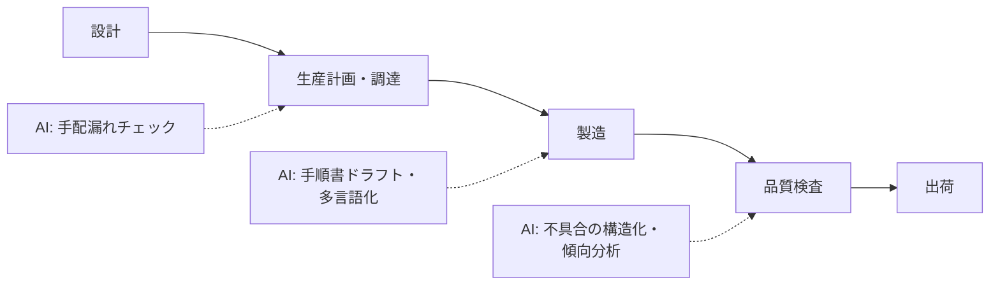

製造業では「文書業務」（手順書・報告書・仕様書）に AI を効かせる余地が大きい一方、**現場の安全と品質に関わる判断は一切 AI に任せない**のが前提です。

## 業務の全体像

- 設計・図面管理
- 作業手順書・作業標準の作成と改訂
- 品質管理（検査記録、不具合対応、8D レポート等）
- 設備保全・在庫・調達の文書業務

## AI が効きそうな場面

| 業務 | AI の関わり方 | 人間に残る役割 |
|---|---|---|
| 手順書作成 | ドラフト生成・構成の統一・図表の文言整理 | 安全性の確認・現場検証・承認 |
| 不具合報告 | 自由記述の分類・傾向の可視化・報告書下書き | 根因分析・対策決定 |
| 検査記録 | 記入漏れチェック・集計 | 判定・合格/不合格の判断 |

## この領域特有の制約

- 安全手順の誤りは**事故に直結**。AI 生成の手順書は必ず現場での検証を経て承認する
- ISO・業界規格の文書要件がある場合、規格への適合確認は人間の仕事
- 設計情報・顧客情報の取り扱い（どの情報を AI に入れてよいかのルール化が必須）

## ユースケース

- [作業手順書の作成・改訂支援](./use-cases/work-instruction.md)
- [不具合報告の整理と傾向分析](./use-cases/defect-report.md)

## 法規と保存期間（この領域の前提）

| 項目 | 内容 |
|---|---|
| 品質文書の体系 | QC 工程表 / 作業標準書 / 不良品処理票（不適合品報告書）/ 是正処置報告書 / 4M 変更届。ISO 9001:2015 の 7.5（成文情報）・8.7（不適合出力）・10.2（是正処置）に対応。自動車なら IATF 16949（PPAP / FMEA / 8D） |
| 保存期間 | PL 法・民法 724 条の 2（引渡しから 10 年）を踏まえ、品質記録・検査記録は 10〜20 年保存が実務の標準。AI 生成物を品質記録にするなら真実性担保（訂正履歴・承認跡）が設計必須 |
| 安全衛生 | 作業手順書は労働安全衛生法 59 条（教育）・リスクアセスメント / KYT とセット。安全注意事項は安全衛生管理者の承認・旧版廃止手順（文書管理）が要る |
| 正本システム | 品質通知は SAP QM、現場データは MES、文書は QMS ソフトが正本。AI は正本から検索し、正本へ書き戻す設計にする |

## AI 導入マップ（業務フロー × AI の掛かる場所）

