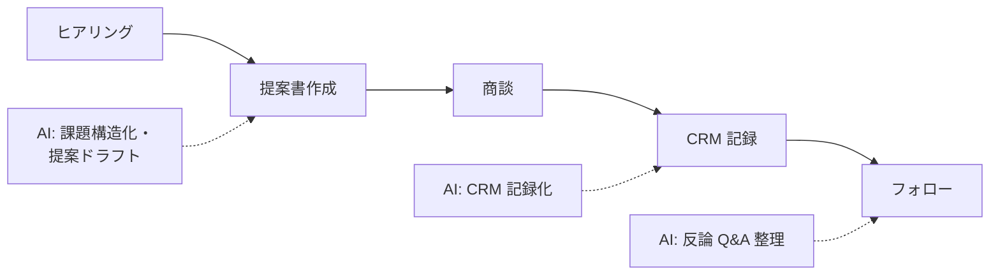

営業の AI 活用は「速く資料を作る」だけでは失敗します。重要なのは**顧客理解を深める時間を AI で捻出する**こと。そして「価格・納期・仕様の約束」は必ず人間が管理します。

## 業務の全体像

- 提案書・見積書の作成
- 商談（ヒアリング・提案・調整）
- 商談記録の CRM 入力と引継ぎ
- 既存顧客のフォロー（カスタマーサクセス）

## AI が効きそうな場面

| 業務 | AI の関わり方 | 人間に残る役割 |
|---|---|---|
| 提案書 | 顧客課題に合わせた構成・文案ドラフト | 課題の解釈・価格・約束 |
| 商談記録 | 録音/メモからの CRM 記録化 | 登録内容の確認・次回戦略 |
| 反論対応 | Q&A セットの整備・ロールプレイ | 実際の回答（責任） |

## この領域特有の制約

- **誇大表現・競合比較の規制**（景表法・優越的地位の濫用等）に触れる文案を AI が生成しない設計
- 顧客情報の取り扱い（CRM 外への入力ルール）
- AI が作った提案に営業自身が「納得していない」状態で客先に出さない

## ユースケース

- [提案書ドラフトの作成](./use-cases/proposal-drafting.md)

## 法規と保存期間（この領域の前提）

| 項目 | 内容 |
|---|---|
| 契約実務 | 下請法の請書は交付から 5 年保存。電子契約（クラウドサイン等）なら紙の収入印紙は不要 |
| 個人情報 | 商談の録音は相手方の同意が前提。顧客情報は CRM 外への持ち出しを規程で制限 |
| 提案の規制 | 景品表示法（誇大・有利誤認禁止）。競合比較表は裏取り根拠の保存が必要 |
| 正本システム | 顧客・案件の正本は CRM。提案書は案件フォルダで版管理、[確定待ち] 残存チェックを通す |

## AI 導入マップ（業務フロー × AI の掛かる場所）

