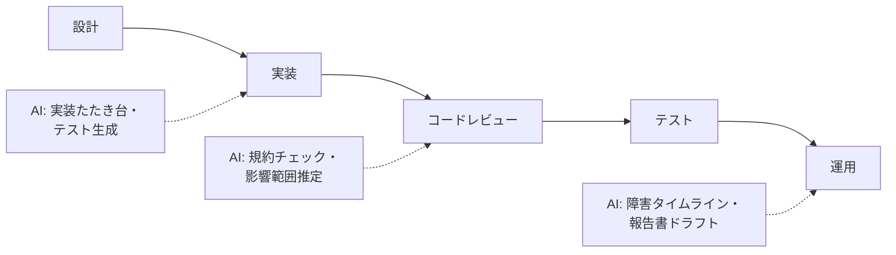

ソフトウェア開発は AI 協働が最も進んでいる領域の一つ。ただし「AI にコードを書かせる」だけでは FDE ではなく、**各工程で判断権がどこにあるか**の設計が本質です。

## 業務の全体像

- 要件定義・設計
- 実装・コードレビュー
- テスト・デバッグ
- リリース・運用（障害対応、ドキュメント整備）

## AI が効きそうな場面

| 業務 | AI の関わり方 | 人間に残る役割 |
|---|---|---|
| 実装 | 定型的な実装・テストコードの下書き | 設計判断・アーキテクチャ決定 |
| コードレビュー | 規約チェック・影響範囲推定・一次指摘 | 設計の妥当性・業務適合の判断 |
| デバッグ | エラー原因の仮説生成・ログ分析 | 根因の特定と修正方針の決定 |
| 障害対応 | タイムライン整理・類似障害の検索 | 対応判断・対外説明 |

## この領域特有の制約

- 生成コードのライセンス・社外秘コードの取り扱い（利用規約の確認は必須）
- 「動くからOK」ではない: セキュリティ・性能の観点は人間の検証が必要
- AI 生成コードの**レビュー負荷が逆に増える**問題 → レビューの型設計が重要

## ユースケース

- [プルリクエストレビュー支援](./use-cases/pr-review-assistant.md)

## 法規と保存期間（この領域の前提）

| 項目 | 内容 |
|---|---|
| 著作権・ライセンス | 生成コードのライセンス汚染に注意。OSS は SBOM（依存一覧）で検査記録を残す |
| 顧客契約 | コード納品範囲・IP 移転・保守範囲は契約書どおり。AI 生成部分の扱いを契約で明文化する流れ |
| 保存期間 | 設計書・レビュー記録は案件完了後も 3〜5 年保存が目安（保守・係争対応） |
| 正本システム | コードの正本は Git リポジトリ。設計判断記録（ADR）もリポジトリ内で版管理する |

## AI 導入マップ（業務フロー × AI の掛かる場所）

