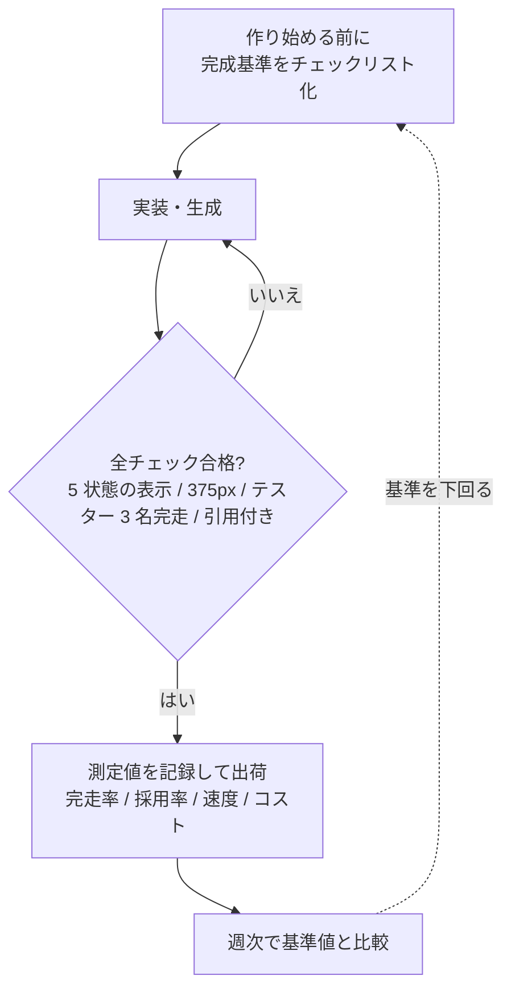

## 目標

- AI の生成物・自分の実装を**出荷してよいか判断する基準**を先に書く
- 「良くなった」を示す測定を 1〜3 個決め、基準値を取っておく

FDE は一人で判断するからこそ、基準がないと「なんとなく良さそう」で出荷してしまう。基準は出荷の 5 分前に作るものではなく、作り始める前に決めるもの。

## 完成の基準の作り方

機能ごとに、検査可能なチェックに落とす:

悪い例: 「ちゃんと動く」
良い例:

- [ ] 5 状態（初期 / 処理中 / 成功 / 失敗 / 空）すべてで正しい表示になる
- [ ] iPhone Safari（375px）で崩れない
- [ ] テスター 3 名が案内なしでタスクを完走
- [ ] AI 出力に引用（根拠）が必ず付いている

**FDE 特有の注意**: AI 製品は「正解がない」出力を扱う。だから「AI の出力が正しいか」ではなく、**出力をユーザーが検証・修正できる設計になっているか**を基準に入れる。（引用の表示、再生成ボタン、部分編集…）

## 測定の選び方

| 種類 | 例 |
|---|---|
| ユーザー行動 | タスク完走率、完走時間、離脱画面 |
| 品質 | AI 出力の採用率（ユーザーが修正した割合）、バグ報告数 |
| 速度 | アイデア → リリースの時間（FDE の核心指標） |
| コスト | 1 ユーザーあたりの AI API コスト |

**基準値を測らずに始めない。** 「完走率 80% → 改修後 95%」と言えないと、改善が感覚になる。

## やることリスト

- [ ] 最初の 1 プロダクトの完成基準をチェックリスト化する
- [ ] 測定 1〜3 個を決め、リリース前の値を記録する
- [ ] 週次で記録を見る時間をカレンダーに入れる（[運用](/process/waterfall/maintenance)の型）

測定の実例は[ユースケース](/domains)の「効果の測り方」セクション参照。

## 次へ

個人で完走できるようになったら [STEP 5: チーム・組織の中で FDE として働く](./step-5-team.md)へ。
