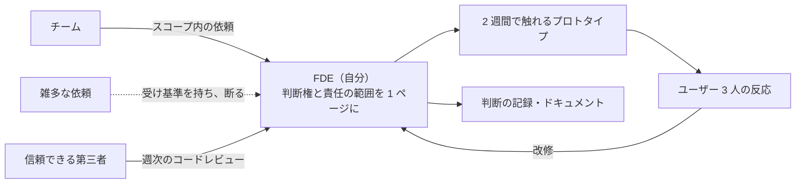

## 目標

自分の FDE 能力を、組織の中で正当に評価される形で使うこと。FDE は「デザイナー + フロントの二合一」= 安く済ませる人材、と誤解されがちである。**成熟 FDE と廉価版を分けるのは、判断権と責任の範囲**である。

## FDE としての価値を守る質問

採用・配属時に聞くべきこと:

- この役割はどのチームに属するか（設計 / 製品 / 工程）
- 書いたコードはどのリポジトリに入り、誰がレビューするか
- 製品・インタラクションの問題について、どこまで自分で決められるか
- 設計と工程の時間配分はどうなっているか
- 過去半年、この役割で実際にリリースされた機能は?

**判断権がなく、レビューもされず、臨時のデザイン依頼を拾うだけ**なら、それは FDE ではない。

## チームに FDE 的な仕事を持ち込む

既存チームの一員として働く場合、価値を証明する形が重要:

- **小さく速く出す**: 2 週間で触れるプロトタイプ → ユーザー 3 人の反応 → 改修。このサイクルを見せると「デザインとコードを一人で回す意味」が伝わる
- **判断を記録する**: なぜその構成・その実装かを 1 行ずつ残す。記録が「ただの速い人」と「信頼できる FDE」の差になる
- **ドキュメントを育てる**: 自分の判断が他の人の助けになっている状態を作る。個人技の共有化が、キャリアの担保になる

## よくある失敗

| 失敗 | 対策 |
|---|---|
| 「速いから」と雑多な依頼を全部拾う | 受け取る仕事の基準を持ち、断る口実を用意する（スコープ外リスト） |
| 生成コードの責任を AI に押す | 自分が出したコードへの責任は譲れない。譲れないなら手を加える |
| 一人で抱えて燃える | 週次のレビュー時間と、信頼できる第三者のコードレビューを確保する |

## やることリスト

- [ ] 自分の仕事の線引き（判断権の範囲）を 1 ページにまとめる
- [ ] チーム/組織との間で、リリースの流れとレビュー体制を確認する
- [ ] 「二合一安価」ポストに落ちていないか、上記の質問で点検する

## 次へ

自分の実践が形になったら [STEP 6: 知見をこの KB に還元する](./step-6-contribute.md)へ。
