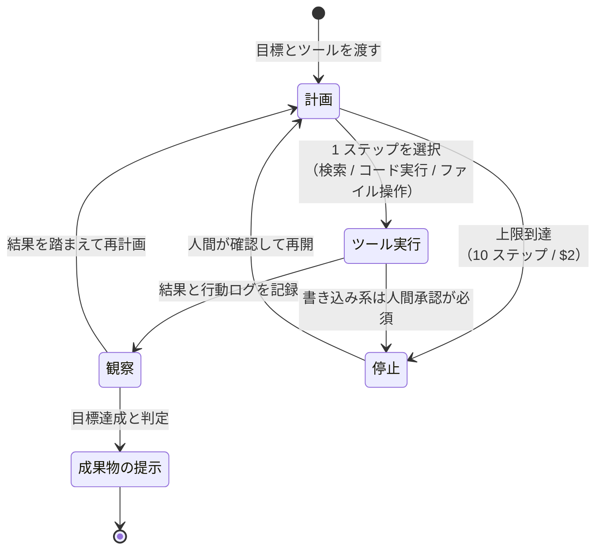

## 概要

単発の Q&A ではなく、**目標とツールを渡して AI に計画・実行・確認のループを回させる**パターン。「資料を集めて比較表を作る」「このリポジトリのバグを直して PR を出す」のような複数ステップのタスクを対象にします。

## 仕組み



## 適している場面

- 手順が事前に完全には決められない、探索的なタスク（調査・デバッグ）
- 複数ツールをまたぐ作業（検索 → 集計 → レポート化）
- 反復のたびに結果を見て次を変える必要がある作業

## 各領域での応用

| 領域 | 応用例 |
|---|---|
| ソフトウェア開発 | バグ再現 → 修正 → テスト → PR 作成の自動化 |
| マーケティング | 競合調査 → 整理 → 比較レポート作成 |
| 製造 | 不具合データの横断集計と傾向レポート |
| 法務 | 関連条文・判例の横断調査と一覧化 |

## 落とし穴

- **暴走と無限ループ**: 実行回数・コストの上限を必ず設定する
- 誤った結果を累積する: 中間成果を人間がチェックポイントで確認する（[Human-in-the-loop](./human-in-the-loop.md)と組み合わせる）
- 権限が大きすぎる: ツールごとに最小権限を与え、破壊的操作は人間の承認を必須にする
- 「何をしたか分からない」: 行動ログの記録を必須にする

## 上限・ツール定義・ログの具体例

| 設定 | 推奨初期値 | 理由 |
|---|---|---|
| 最大ステップ数 | 10 ステップ | 無限ループの防止。足りなければ人間が継続を判断 |
| コスト上限 | $2/タスク | 暴走時の損害を固定額にする |
| ツール権限 | 読み取り系のみ / 書き込みは承認必須 | 破壊的操作（削除・送信）は人間の承認を必須化 |

ツール定義のスキーマ例:

```json
{ "name": "search_docs", "input_schema": { "type": "object",
  "required": ["query"], "properties": { "query": { "type": "string" }, "limit": { "type": "integer", "maximum": 20 } } } }
```

行動ログの形式（1 ステップ 1 行・JSON）:

```json
{ "step": 3, "tool": "search_docs", "input": {"query": "返品規定"}, "result_summary": "3 件ヒット", "tokens": 1420, "elapsed_ms": 830 }
```

このログがないエージェントは、失敗したときに何が起きたか説明できない。

## 正常ログ vs 暴走ログの見分け

✅ **正常**: 各ステップのツールが変わり、tokens が一定範囲（例: 1 ステップ 500〜2000）で、入力と出力が課題に関連している

❌ **暴走**: 同一ツールを同一引数で 3 回以上繰り返す / tokens が急増 / 読み取り専用のはずが書き込み系ツールを呼ぶ。→ 上限（10 ステップ / $2）で止まり、ログを人間が確認してから再開する
