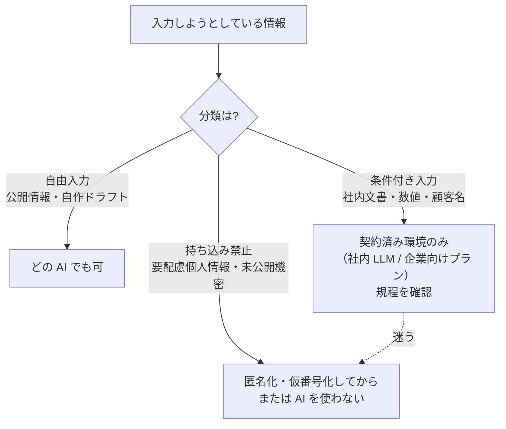

## 概要

どの領域でも最初に起きる事故は性能の問題ではなく**情報の持ち込み**です。このパターンは「この入力はどこまで渡してよいか」を、作業のたびに判断できるよう形にしたものです。

## 仕組み: 入力を 3 分類する

| 分類 | 内容 | 扱い |
|---|---|---|
| **自由入力** | 公開情報・自作のドラフト | どの AI でも可 |
| **条件付き入力** | 社内文書・数値・顧客名など | 契約済み環境（社内 LLM / 企業向けプラン）のみ。規程確認 |
| **持ち込み禁止** | 要配慮個人情報・未公開の機密・規程で禁止されたもの | 匿名化・仮番号化してから、または AI を使わない |

判断が迷うときは **条件付き入力より厳しい側** に倒す。

## 匿名化の型

1. 人名・患者名・顧客名 → 仮番号（A 氏、患者 3、顧客 X）
2. 固有数値 → 桁を残した近似値、またはマスク（[確定待ち]）
3. 対応表は AI 環境に置かない。自分の手元で復元する

## 適している場面

- **すべての場面**。特に: 医療の記録（[看護記録](../domains/healthcare/use-cases/nursing-record.md)）、人事の面接メモ、法務の契約書、経理の数値、営業の案件情報

## 落とし穴

- 「このサービスなら大丈夫だろう」という根拠のない判断 → 利用規約と社内規程の**二重確認**を最初の 1 回は必ずやる
- 匿名化したつもりの残骸（役職+年齢+地域で特定可能など）→ 複数の属性の組み合わせも個人情報になりうる
- ルールだけ作って運用が追いつかない → 役割分担表の「禁止」リスト（[STEP 2](/guide/step-2-define-roles)）に入れ、レビューで点検する

## 利用プランの実名対応（2026-09 時点の一般論・利用前に必ず最新規約を確認）

| プラン | 入力が学習に使われるか | メモ |
|---|---|---|
| ChatGPT 無料 / Plus | 原則使われる（設定でオプトアウト可） | 業務データの常時利用には不向き |
| ChatGPT Team / Enterprise | 使われない（契約上） | 保持期間・監査は管理画面で制御 |
| Anthropic API / Bedrock / Azure OpenAI | 使われない（API は契約上、学習に使用しない） | 入力保持期間はプラン別に確認 |
| Microsoft 365 Copilot | テナント境界内で処理 | Graph 経由で組織データにアクセス |

- SIer の鉄則: **顧客データは顧客のテナント内でのみ処理**。持ち込み前にセキュリティ部門の事前申請（データの加工可否・範囲）を通す
- 「契約済み環境」の判断はこの表 + 顧客のセキュリティポリシー照合で行う。迷ったら禁止扱い
