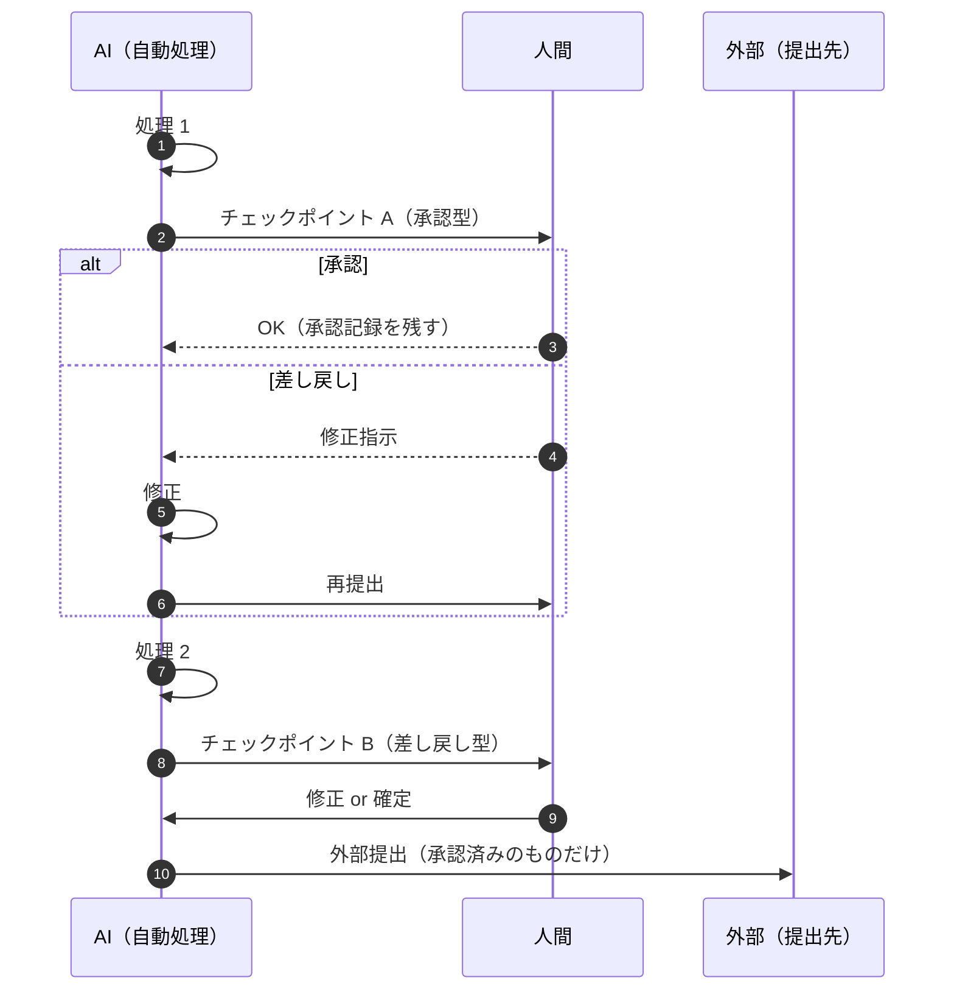

## 概要

AI の出力をそのまま使うのではなく、**人間が確認・判断する地点（チェックポイント）を意図的に設ける**パターン。FDE の各工程で「人間の役割」を担保するための最も基本的な仕組みです。

## 仕組み



チェックポイントには 3 種類あります。

| 種類 | 内容 | 例 |
|---|---|---|
| **承認型** | 人が見て OK としたときのみ有効 | 本番リリース、契約の締結、対外送信 |
| **差し戻し型** | 人が修正して返せる | 採点下書き、記事ドラフト |
| **監査型** | 後から記録で確認できる | 自動分類の精度サンプリング |

## 適している場面

- 間違いの外部コストが高い場所（最終承認・送信前）
- 判断に専門性・責任が伴う場所（医療・法務・安全）
- AI の精度が 100% でない（=常に）あらゆる自動処理

## 各領域での応用

- 教育: 採点の確定は教師（[採点支援](../domains/education/use-cases/grading-assistant.md)）
- 製造: 安全手順の記入は AI に生成させない
- 法務: 契約リスクの評価は人間、AI は事実整理まで

## 落とし穴

- **承認の形骸化**: 毎回 OK になるなら、チェックポイントの位置か AI の精度に問題がある
- 多すぎるチェックポイント: 効果が消える。リスクの大きい場所に絞る
- 記録の欠落: 誰が・いつ・何を承認したかを必ず残す（監査可能性）

## サンプリング率と承認記録の実務

- サンプリング率の実務ルール: 初期は **10%** を人間が検収し、**誤検知・誤判定 0 件が 4 週間続いたら 5% へ下げる**。1 件でも問題が出たら 10% に戻す
- 承認記録の形式（監査・再発防止の最低セット）:

```json
{ "who": "教師 A", "when": "2026-09-13T10:20+09:00", "what": "答案 12 件の採点下書き", "decision": "承認（1 件修正）", "reason": "設問 3 の達成度を B→C に修正。根拠の引用が答案と不一致のため" }
```

- 記録は正本システム（校務支援 / 文書管理 / CRM）側に残す。AI 側だけに置かない
