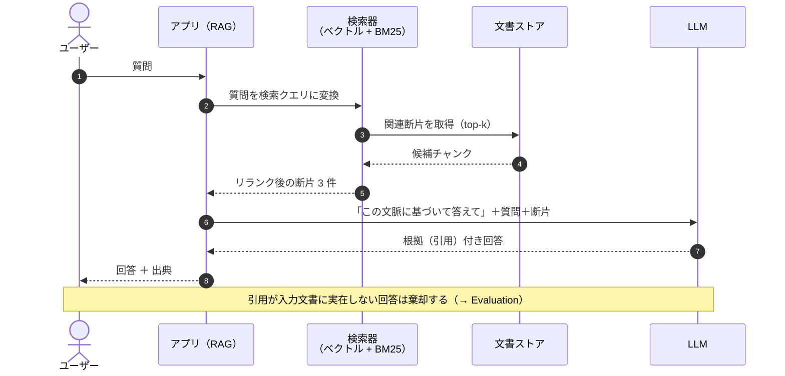

## 概要

LLM に直接質問すると、古い・汎用的・場合によっては誤った回答が出る。RAG（Retrieval-Augmented Generation）では、まず手持ちの文書群から関連箇所を**検索**し、その内容を文脈として渡してから**生成**させる。ハルシネーションを減らし、根拠を示せるようにする最も基本的なパターン。

## 仕組み



## 適している場面

- 社内規定・マニュアル・過去案件資料など「閉じた知識」への質問応答
- 専門分野の文書の要約・引用付き回答
- 回答に必ず出典を付ける必要がある業務

## 各領域での応用

| 領域 | 応用例 |
|---|---|
| 教育 | 教科書・過去問に基づく質問応答（[採点支援](../domains/education/use-cases/grading-assistant.md)） |
| 法務 | 判例・社内規定の引用付き回答 |
| 製造 | 設計基準・作業手順書の検索 |
| 医療 | 診療ガイドラインの検索（最終判断は人間） |

## 落とし穴

- 検索で外れた断片が渡ると、もっともらしい誤答になる → 検索品質（チャンク分割・評価）が本質
- 「出典付き」でも引用箇所が間違っていることがある → 引用の自動検証を入れる
- 文書の更新漏れで古い知識が残る → 文書の鮮度管理を運用設計に含める

## 初期構築パラメータ（現場の推奨値）

| パラメータ | 推奨初期値 | 理由 |
|---|---|---|
| チャンクサイズ | 512 トークン | 1 概念 1 チャンクが目安。1024 超は検索精度が落ちやすい |
| チャンクオーバーラップ | 100 トークン（約 20%） | 断片の文脈切れを防ぐ |
| 埋め込みモデル | 多言語対応・1024 次元級 | 日本語混在文書では多言語モデルが必須 |
| 検索方式 | ハイブリッド（ベクトル + BM25） | 固有名詞・型番はキーワード検索が強い |
| top-k | 検索 5 → リランク後 3 | ノイズ削減。コンテキスト長の節約にもなる |
| 評価 | 質問 20 件で hit@3 ≥ 0.7 / 引用実在率 100% | 達成後 2 週間運用してからパラメータを固定 |

- 文書がスキャン PDF の場合は OCR 前処理が必須（表は別ロジックで分割）
- うまく検索できない質問があったら、まず「どのチャンクに入っているべきか」を目視確認——**検索の外れは大半がチャンク分割の設計ミス**

## 出力の合格例 / 不合格例

✅ **合格例**（引用が実在し、検証可能）:

```text
頂点は (2, -3) です。
根拠: 答案 3 行目「y = (x - 2)² - 3」の記載より。
```

❌ **不合格例**（引用なし・検証不可能）:

```text
頂点は (2, -3) だと答案で確認できます。平方完成が正しく行えています。
```

不合格例を防ぐ設計: 引用を必須項目にし、**引用文字列が入力文書に実在するかをコードで照合**する（実在しない回答は棄却）。
