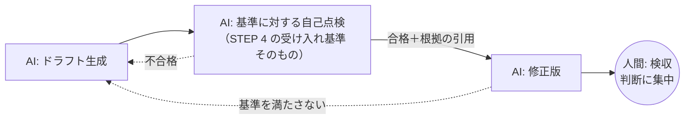

## 概要

AI の出力をすぐ人間に渡すのではなく、**受け入れ基準を渡して AI 自身に点検・修正させる**パターン。「たたき台 → 自己点検 → 修正済み成果物 → 人間の検収」という順にすることで、人間のレビューは「細かい指摘」から「判断」に変わります。

## 仕組み



プロンプトの型:

```text
上記の出力を、次の受け入れ基準で自己点検してください。
基準: （STEP 4 で決めたチェックリストをそのまま貼る）
・各基準について 合格/不合格 と、根拠（本文の該当箇所）を出す
・不合格があれば修正版を出す
```

## 適している場面

- 受け入れ基準を明文化できているタスク（[STEP 4](/guide/step-4-acceptance) を終えていることが前提）
- 手戻りコストが高い成果物（提出物・対外文書）
- レビュー工数が足りないチーム

## 各領域での応用

- 教育: 採点下書きがルーブリック全項目を満たすか自己点検（[採点支援](../domains/education/use-cases/grading-assistant.md)）
- 法務: 条項抽出に抜けがないか、自己点検で項目数を再確認
- 製造: 手順書ドラフトの `[要確認]` 残存を自己申告させる

## 落とし穴

- **自己点検は自己肯定に寄る**: 「合格」と言わせただけでは意味がない。根拠（該当箇所の引用）を必須にし、引用できない基準は不合格扱いにする
- 基準が曖昧だと自己点検も曖昧。まず受け入れ基準を書く（[評価パターン](./evaluation.md)と併用）
- 2 周目以降は効果が薄れる。1〜2 周で止め、人間の検収につなぐ
