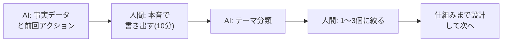

## この工程の目的

チームのレトロは「次の動きを変える会議」。FDE の個人のレトロは**「次のスプリントの、自分のやり方を 1 つだけ変える」30 分の儀式**である。一人だと「振り返っても同じ結論になる」のが最大の罠。だから、AI を「反対側のレビューアー」にして、自分一人では出せない視点を引き出す。

- **インプット**: 週の前進記録（デイリーの産物）、リリース実績、障害と遅延の記録、時間の使われ方の実感
- **アウトプット**: やり方の変更 1 つ（次スプリントで試す・成功基準付き）
- **FDE 版の時間感覚**: スプリント末の 30 分。書く量より、決める 1 つが重要

## よくある失敗

1. **感想で終わる**: 「疲れた」「速度が出ない」。変えるものが決まらない
2. **AI の分析を鵜呑みにする**: AI は自分のコンテキスト（本業の忙しさ・体調）を知らない
3. **同じ改善を毎回決める**: 「深夜作業をやめる」が半年連続で決まる。実行の仕組みまで設計していない
4. **成功を振り返らない**: 失敗だけ見て、うまく行ったパターンを再利用しない

## FDEの仕事

- **事実を並べる**: 感想ではなく記録（コミット、リリース、テスターの声、実際の作業時間）を集める
- **1 つを決める**: 変えるのは 1 つ。そして「どうやったら実行されるか（仕組み）」まで決める
- **自分への反対尋問**: 「この改善、前にも決めてなかった?」を AI に問わせる。過去のレトロの記録が効く瞬間

## AIツールの使いどころ

| 局面 | ツール | 使い方 |
|---|---|---|
| 事実の整理 | Claude Code (リポジトリ・ログ) | コミット頻度・リリース回数・作業時間帯の分布を客観に出させる |
| パターンの指摘 | Claude / GPT | 過去のレトロ記録と突き合わせ、「繰り返している問題」を検出させる |
| 変更案の設計 | Claude / GPT | 「習慣化の仕組み（トリガー・成功基準）」まで設計させる。決意文で終わらせない |
| 反対尋問 | Claude / GPT | 決めた改善の「失敗しそうなシナリオ」を出させる |

## 進め方（実プロンプト付き）

### スプリント末 30 分の型

```text
個人のレトロスペクティブです。事実データを貼ります。
①この 2 週間の客観データ: コミット 23 件 / リリース 1 回 / ユーザーテスト 3 名（目標 5 名）/ 作業時間 平日夜中心
②感じたこと: ユーザーテストの準備で 2 日溶けた / 深夜作業が 4 日あった

整理をお願いします:
・データから見える「うまく行ったパターン」と「繰り返している問題」
・問題ごとに「仕組みとしての改善案」1 つずつ（「気をつける」は禁止。トリガーと成功基準を含める）
・改善案は最大 3 つ。優先順位も付けて
```

### 決めた 1 つの仕組み化

```text
次の改善を実行に移す仕組みを設計してください。
改善: ユーザーテストを 1 人分ずつ小さく回す（まとめて 5 人を最後にやらない）
失敗しそうなシナリオを 3 つ出し、それぞれの対策（リマインダーのタイミング、テンプレート、目標の分解）まで含めてください。
```

### 過去との照合（FDE 固有の一手）

```text
過去 3 回のレトロ記録を貼ります。
今回決めた改善「〇〇」と同じ・似たものが過去にないか確認してください。
あった場合は、なぜ続かなかったかの記録を引き出し、今回の仕組みに反映すべき点を提案してください。
```

## 成果物と受け入れ基準

- やり方の変更 1 つ（トリガー・成功基準・実行の仕組み付き）、週の前進記録のアーカイブ

受け入れ基準:

- [ ] 事実データ（コミット・リリース・時間）に基づいている
- [ ] 変更は 1 つ。そして「仕組み」まで設計されている
- [ ] 過去のレトロと照合し、繰り返し問題なら対策が変わっている
- [ ] うまく行ったパターンが 1 つ以上言語化されている
- [ ] 次スプリントのプランニングで、この変更が実際に適用される

## 前後の工程との接続

- **プランニングへ**: 決めた変更は次のプランニングから適用する。レトロで決めて終わりが最も多い失敗
- **デイリーへ**: 週の前進記録の蓄積は、デイリーの 15 分でできている。日々の記録なしに良いレトロは作れない

## 顧客案件での追加事項（FDE 差分）

- **顧客フィードバックも材料**: 現場の声・反応・使われない機能を客観データと一緒に振り返る
- **工数実績と請求のズレ分析**: 見積もりと実工数のズレは、次の見積もりの精度改善に直結する（[市場分析](/references/market-demand)にある「要件化スキル」の実力そのもの）

## 工程フロー（FDE の回し方）


