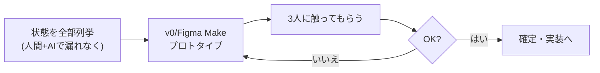

## この工程の目的

FDE の設計は「Figma の静的モックを作る」ことではない。**ユーザーがタスクを完走するまでの状態遷移を設計すること**である。AI 製品は従来のページと違い、ローディング・ストリーミング出力・失敗・部分的成功・確認待ちなど「成功画面以外の状態」が体験の大部分を占める。静的な完成稿では表現しきれない——だから FDE は動くプロトタイプで設計する。

- **インプット**: 課題定義、シナリオ、Must リスト
- **アウトプット**: タスクフロー図、状態一覧（正常・待機・失敗・空・エラー）、動くプロトタイプ、デザイン判断のメモ（なぜこの構成か）
- **FDE 版の時間感覚**: 静的モックに数日かけるより、1 日で動くものを作り触ってもらう。設計と実装の境界は曖昧でよい

## よくある失敗

1. **成功画面だけ設計する**: AI の出力待ち・失敗・再試行の状態が未設計のまま実装に入る
2. **AI の出力を「答え」として設計する**: AI 製品の出力は不確実。ユーザーが修正・再生成・部分的に採用する動線がない
3. **v0 の第一案をそのまま採用する**: ツールの出力は平均的なデザイン。評価基準を持たずに選ぶと「どこにもある UI」になる
4. **モバイルを後回しにする**: PWA / レスポンシブは後付けだとコストが跳ね上がる

## FDEの仕事

- **状態の列挙**: 1 画面でも「初期 / 読み込み中 / 出力中 / 成功 / 部分成功 / 失敗 / 空結果 / 権限なし」を全部書き出す。ここを面倒がらないのが FDE の差
- **情報の優先順位の決定**: 何を最初に見せるか。AI の出力より「待っていることを知らせる表示」が先かもしれない
- **デザイン判断への責任**: 色や余白の裁量は持つ。「なぜこの配置か」を 1 行で説明できる状態を保つ
- **ユーザーに触ってもらう**: 静的稿の承認ではなく、動くもので 3 人に触ってもらう

## AIツールの使いどころ

| 局面 | ツール | 使い方 |
|---|---|---|
| 状態の列挙 | Claude / GPT | 画面の状態一覧を出させる（自分の列挙と突き合わせて漏れを潰す） |
| プロトタイプ | v0 / Figma Make | シナリオを渡して初版を生成。ただし生成物は「叩き台」と割り切り、状態遷移は自分で書き足す |
| UI の検討 | Figma（AI 機能付き） | コンポーネント化・Auto Layout で構造を作ってからコードへ |
| 実装直結の試作 | Claude Code / Cursor | 「プロトタイプをコードに落とす」段階は実装工程へ直行してよい |

## 進め方（実プロンプト付き）

### ステップ 1: 状態遷移の洗い出し

```text
あなたはシニアプロダクトデザイナーです。次の機能の「画面の状態」を全て列挙してください。
機能: AI 会議議事録（録音アップロード → 文字起こし → 議事録生成 → 編集 → 共有）
観点: 初回表示 / 入力 / 処理待ち（時間がかかる）/ ストリーミング中 / 成功 / 部分的失敗（音声が悪い）/ 完全失敗 / 空結果 / 権限・制限 / 再試行
各状態に「ユーザーに何を表示し、何をさせられるか」を 1 行で。
```

→ 自分でも 1 人で列挙してから実行する。**AI は漏れの検出に使い、思考の代用にしない**。

### ステップ 2: 動くプロトタイプ（v0 / Figma Make）

```text
（v0 へ）次のシナリオのプロトタイプを作ってください。
シナリオ: 会議の録音をアップロードし、処理中は経過が見えて、完成したら議事録を編集して共有できる。
必須の状態: アップロード失敗 / 処理中（進捗つき）/ 文字起こしが粗い場合の警告 / 共有成功
デザイン: 最小限でよい。まず状態遷移が触れること重視。
```

→ 生成後に自分で直す: 空状態、キーボード操作、モバイル幅の確認。**この「生成後に直す工程」が FDE の品質**。

## 成果物と受け入れ基準

- 状態一覧、フロー図（手描きでよい）、動くプロトタイプの URL、判断メモ

受け入れ基準:

- [ ] 成功以外の状態が全て設計されている（失敗・待機・空・権限）
- [ ] AI の出力に対する「修正 / 再生成 / 部分採用」の動線がある（AI 製品の場合）
- [ ] プロトタイプを 3 人に触ってもらい、つまずき点を記録した
- [ ] 主要なデザイン判断に「なぜ」が 1 行ある
- [ ] モバイル幅で崩れないことを確認した

## 前後の工程との接続

- **要件 ←（逆方向）**: プロトタイプを作ると「これは要らない」と分かる。遠慮せず Must を削る
- **実装へ**: プロトタイプは捨ててもよい（設計のための砂場）。実装は本リポジトリでゼロから AI に書かせてよい。**プロトタイプのコードを流用するかは、その場で判断**してよい

## 顧客案件での追加事項（FDE 差分）

- **顧客テナント内に寄せる構成**: 新規クラウドを持ち込まず、顧客の既存 AWS / Azure / GCP アカウント内で構成図を描く（[クラウド別マップ](/references/cloud-ai-services)）
- **既存システム連携の方式決定**: 基幹システム（SAP / 国産 ERP）との接続は API > CSV バッチ > RPA の順で検討する
- **セキュリティ審査資料**: データフロー図・権限表・外部送信の有無——顧客のセキュリティ審査に通る形で AI にドラフトさせる

プロンプトの合格例 / 不合格例:

- ✅ 合格例: 状態一覧に「権限なし / レート制限到達 / 顧客データ件数 0 件」まで含まれる
- ❌ 不合格例: 正常フローの 3 画面しか列挙していない → 「失敗・待機・空・権限の 4 分類を必ず含める」を指示に追加

## 工程フロー（FDE の回し方）


