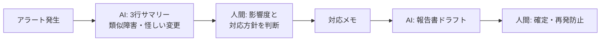

## この工程の目的

FDE の運用は「サーバーを監視する」ことではない。**「使われ方を見て、次の一手を決め、速く出す」こと**である。FDE の強みは改善サイクルが最短（気づき → 修正 → リリースが数時間）なところにあり、それを仕組みとして維持する。逆に言えば、リリース後にデータもフィードバックも見ない FDE は、ただの開発者に戻ってしまう。

- **インプット**: アナリティクス、エラーログ、ユーザーからの連絡、自分の違和感
- **アウトプット**: 週次の改善リスト（1〜3 項目）、修正のリリース、使い方ドキュメントの更新
- **FDE 版の時間感覚**: 週 1〜2 時間の「運用の時間」を固定で取る。都度対応ではなく、まとめて見て決める

## よくある失敗

1. **リリースして終わる**: データを見ず、次の機能開発に走る
2. **フィードバックを個別対応で消化する**: 同じ声が 3 回来ても仕組みで直さない
3. **エラー通知が来ても流す**: Sentry の通知を見慣れて無視する
4. **AI コストの放置**: 利用が増えて API 請求だけが増える。単位コストの把握がない
5. **ドキュメントの腐敗**: 使い方が変わったのに案内が古いまま

## FDEの仕事

- **週次のデータレビュー**: 誰が・どこで・どれだけ使ったか。離脱の多い画面はどこか
- **改善の選別**: 声・データ・自分の直感から、次に直す 1〜3 個を決める。全部は直さない
- **障害対応**: 通知が来たら止まる。確認と切戻しの判断は人間
- **コストの把握**: 1 ユーザーあたりの AI コストを知っている。無料で回る設計か、課金にするかの判断材料

## AIツールの使いどころ

| 局面 | ツール | 使い方 |
|---|---|---|
| 週次レビュー | Claude (Analytics のエクスポートを貼る) | 数値の変化・異常・見るべき箇所のサマリーを作らせる |
| エラー分析 | Claude Code (Sentry のログを渡す) | エラーの分類・頻度・疑わしいコミットの特定 |
| フィードバック整理 | Claude / GPT | 自由記述の分類とテーマ化（同じ声を束ねる） |
| 修正実装 | Claude Code / Cursor | 週次の改善リストを小さく回す |

## 進め方（実プロンプト付き）

### 週次: データレビュー（30 分）

```text
アプリの週次データを貼ります。次の形式でレビューしてください。
①この週の変化: ユーザー数 / 完了率 / 離脱が多い画面
②気になる点と、確認すべき仮説（例: 「議事録画面の離脱が 40% → 編集が重い可能性」）
③次週に直す価値が高そうな上位 2 項目と理由
※判断は私がします。データの読み取りと仮説の整理だけお願いします。
```

### フィードバックの束ね

```text
使ってくれた人からのコメント 7 件を貼ります。
・テーマ別に分類（同じ声を束ねる）
・対応の緊急度を A（壊れている）/ B（直す価値）/ C（好み）で仮判定
・A のものは再現に必要な追加情報を 1 行
```

### 障害発生時（自動通知が来たら）

```text
Sentry からこのエラー通知が来ました。
①何が起きているか 2 行で
②ユーザーへの影響範囲
③選択肢（切戻し / ホットフィックス / 次回修正まで様子見）と、それぞれの作業量の概算
判断は私がします。
```

## 成果物と受け入れ基準

- 週次レビューの記録、改善リストとそのリリース、更新されたドキュメント

受け入れ基準:

- [ ] 週次のレビューが習慣化している（少なくとも隔週）
- [ ] 改善は一度に 1〜3 項目に絞られ、速く出されている
- [ ] 同じフィードバック 3 回で「仕組みでの対応」になっている
- [ ] 1 ユーザーあたりの AI コストを把握している
- [ ] 障害通知を 24 時間以内に確認し、対応方針を出している

## 前後の工程との接続

- **要件 ←（ループの起点）**: データとフィードバックの分析は、次の要件定義のインプット。**リリース → 運用 → 気づき → 次のサイクル**が FDE の最強ループ
- **README / 案内へ**: 使い方が変わったらドキュメントを同時に直す。古い案内は信頼を静かに削る

## LLM システム特有の運用（モデル廃止・レート制限・縮退）

### モデル EOL 追跡表

| プロバイダ | モデル | 廃止発表日 | 提供終了日 | 移行先 | 移行コスト |
|---|---|---|---|---|---|
| （例） | claude-3-sonnet | 2026-07 | 2026-11 | claude-sonnet-4.x | プロンプト再評価 2 日 |

- プロバイダの deprecation 通知をウォッチし、**表の行が増えたら移行タスクを起票**する。移行時は[評価](/patterns/evaluation)を再実行して品質低下を検出する

### 429（レート制限）対応

```ts
// 指数バックオフ: 初期 1 秒、最大 5 回、ジッタ付き
const delay = Math.min(1000 * 2 ** attempt, 30000) + Math.random() * 500;
```

### 縮退運転の仕様

- LLM タイムアウト 30 秒 → 「処理中に時間がかかっています」+ 部分結果表示 + 再試行ボタン
- モデル障害時は機能を止めず、キュー保存後に後段処理（非同期化）

## 顧客案件での追加事項（FDE 差分）

- **SLA の管理**: 対応開始時間・解決時間の約束を守る体制（通知の見方、エスカレーション先）を文書化
- **定例報告**: 週次/月次で「稼働状況・インシデント・改善・コスト」を報告。AI がドラフトを作り、FDE が判断を加える
- **モデル移行の顧客通知**: [モデル EOL 追跡表](/patterns/evaluation)の動きを顧客と共有し、移行計画・再評価を合意しておく
- **引き継ぎまたは継続契約**: 記録の質がそのまま引き継ぎの質。検索可能な形で蓄積し続ける

## 工程フロー（FDE の回し方）


