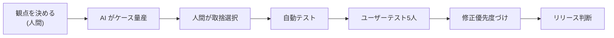

## この工程の目的

FDE のテストは 2 層ある。**①コードが壊れていないこと（自動テスト）と、②体験が成り立っていること（ユーザーテスト）**。一人で作ると自分の環境では完璧に動く——だから他人の環境・他人の操作・他人のネットワークで壊す必要がある。「自分が触って OK」はテストではない。

- **インプット**: 動作するアプリ、状態一覧（設計）、成功基準（要件）
- **アウトプット**: 自動テスト一式、5 人のユーザーテストの記録、修正リスト、リリース可否の判断
- **FDE 版の時間感覚**: 自動テストは AI に書かせ、人間の時間は 5 人のユーザーテストに全振りする

## よくある失敗

1. **自分のマシンでしか確認していない**: iPhone の Safari、遅い回線、文字サイズ大で壊れる
2. **AI 出力の検証をしない**: AI 製品の核心は「出力が不確実」なのに、正解ケースだけでテストする
3. **自分をユーザーテストの代わりにする**: 作った本人は絶対に操作を間違えられない
4. **エッジケースを AI に書かせて終わり**: 境界値の候補は AI が得意だが、業務上の「ここが壊れたら致命的」の判断は FDE の仕事

## FDEの仕事

- **壊れると致命的な箇所の指定**: データ消失・課金・権限。ここは重点的に、残りは軽く
- **ユーザーテストの実施**: 5 人に同じタスクをやってもらい、黙って観察する。「ここを押して」は禁止。つまずきポイントの記録
- **テスト範囲の取捨選択**: 全部は確認できない。今回はどこを確認するか、何を「今回は確認しない」と割り切るか
- **リリース可否の判断**: 既知の未修正バグを踏まえて、出すか出さないか

## AIツールの使いどころ

| 局面 | ツール | 使い方 |
|---|---|---|
| 自動テスト生成 | Claude Code / Cursor | 状態一覧を渡して E2E（Playwright）と単体テストを生成。アサーションの中身は自分で確認 |
| エッジケース列挙 | Claude / GPT | 入力の境界値・異常系の網羅候補（自分が見落としたものを拾う） |
| AI 出力の検証設計 | Claude / GPT | 「AI の要約の品質を機械的に判定する基準」の設計相談（引用が存在するか等） |
| アクセシビリティ検査 | Lighthouse / axe | 生成後に自分で回す。点数より指摘の中身を見る |

## 進め方（実プロンプト付き）

### ステップ 1: 自動テストを状態一覧から生成する

```text
（Claude Code へ）アプリの状態一覧を渡します。Playwright の E2E テストを書いてください。
対象の状態: アップロード失敗 / 処理中 / 文字起こしが粗い警告 / 共有成功 / 空結果
ルール:
・各テストはアサーションを実質的に含むこと（「エラーが出ない」は無効）
・ローディング状態はモックで再現する
・モバイルビュー（375px）で崩れないことを含める
```

### ステップ 2: AI 出力の品質検証を設計する（AI 製品特有）

```text
このアプリの核心は「AI 議事録の品質」です。品質を検証する仕組みを設計してください。
方針: ①録画した会議（正解あり）を 3 本用意し、要点が押さえられているかのチェックリスト判定
②アクション抽出の漏れ検証（元音声のアクションをリスト化し、AI 出力に含まれるか）
③生成 10 回のばらつき確認（同じ入力で大きく違う出力にならないか）
実装可能な形（チェックリスト / スクリプト）で提案してください。
```

### ステップ 3: ユーザーテスト（5 人 × 15 分）

```text
ユーザーテストのセッション設計を手伝ってください。
タスク: 「このアプリで、会議の録音から議事録を作り、チームに共有する」
・事前説明のスクリプト（期待を誘導しない形で）
・観察記録のテンプレート（つまずき箇所 / 言い淀み / 無言が 5 秒以上の場所）
・後で聞く質問 3 個（「使いやすい?」は禁止。「どこで不安になりましたか?」等）
```

### ステップ 4: 修正の優先度づけ

```text
ユーザーテストの記録から、修正リストを優先度付きで作ってください。
分類: A=タスク完走を妨げる / B=つまずくが回避可能 / C=気になるが許容
根拠（何人がつまずいたか）を必ず付ける。A がゼロになるまでリリースしないのが基本ルール。
```

## 成果物と受け入れ基準

- 自動テスト一式（CI 通過）、ユーザーテスト記録 5 名分、修正リスト、リリース判断

受け入れ基準:

- [ ] 設計の状態一覧の全状態をテストでカバーしている
- [ ] モバイル（375px）とデスクトップで確認している
- [ ] 実ユーザー 5 人のテストを実施し、A 分類が 0 件になっている
- [ ] AI 出力の品質検証（正解ありのチェックリスト）を 1 回以上実行した
- [ ] 「今回は確認しない」項目を明示した上でリリース判断をしている

## 前後の工程との接続

- **実装 ←（逆方向）**: ユーザーテストで見つかった問題の多くは「実装のバグ」ではなく「設計の抜け」——状態一覧に戻して設計から直す
- **リリースへ**: 未修正の B/C 分類はリリースノートの既知問題として載せる。隠さない

## 顧客案件での追加事項（FDE 差分）

- **UAT（顧客受け入れテスト）**: 合意書の閾値で判定し、**顧客側責任者の署名（またはメール承認）**を検収の証拠として残す
- **正解データは顧客提供**: 精度計測に使う正解（例: 過去 100 件の実データ）は顧客から提供を受け、双方立会いで計測する
- **本番データでの残影テスト**: テスト環境では見えない「実データの偏り」を、本番相当データで確認する

プロンプトの合格例 / 不合格例:

- ✅ 合格例: テストケースに前提・操作・期待結果が揃い、境界値に実務の数値（請求書 200 件など）を使っている
- ❌ 不合格例: 「正常に動作すること」だけで検証方法が書かれない → 期待結果は観察可能な事実で書くよう指示に追加

### 自動テストの実コード断片（Playwright・状態一覧から生成）

```ts
test("アップロード失敗時に再試行できる", async ({ page }) => {
  await page.route("**/transcribe", (r) => r.abort()); // ネットワーク失敗を再現
  await page.goto("/upload/");
  await page.setInputFiles('input[type="file"]', "test/meeting.m4a");
  await expect(page.getByText("アップロードに失敗しました")).toBeVisible();
  await page.getByRole("button", { name: "再試行" }).click();
  await page.unroute("**/transcribe");
  await expect(page.getByText("文字起こし中")).toBeVisible({ timeout: 10000 });
});
```

- 状態一覧の 1 状態 = 1 テスト。AI 製品は「AI 出力のばらつき」もテスト対象: 同一入力 10 回で合格判定が 9 回以上一致することを回帰として回す

## 工程フロー（FDE の回し方）


