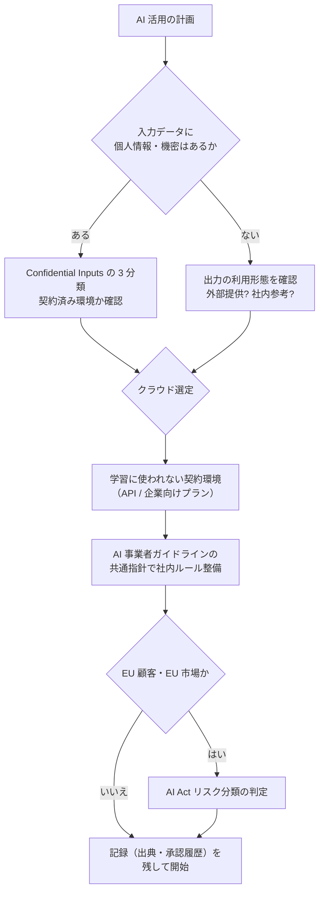

AI 導入で企業が最初につまずくのは技術ではなく**法的な不安**です。このページは、FDE が案件で必ず確認すべき法規・ガイドラインを横断整理したものです。

> **重要**: ここは概観を示すものです。法規は更新が速く、解釈は案件ごとに変わります。
> 実務では必ず一次情報（下記リンク）の最新版を確認し、重大案件は法務・専門家に相談してください。

## 日本

| 法・ガイドライン | 生成 AI への関わり | FDE の実務上のポイント |
|---|---|---|
| **AI 事業者ガイドライン**（経産省・総務省、2024 策定・随時更新） | AI 開発者・活用者の両方を対象とするソフトロー。透明性・人間による確認・公平性などの共通指針 | 「ガイドライン準拠」と提案書に書ける。社内ルール整備の土台に使う |
| **著作権法 30 条の 4** | 情報解析（AI 学習）目的の著作物利用は原則適法。ただし**権利者の利益を不当に害する場合は適用外** | 学習（解析）と生成物の提供は別問題。生成物が既存作品に類似しない設計と出典管理を |
| **個人情報保護法** | 要配慮個人情報の AI 入力、委託先管理、生成物からの特定可能性 | [Confidential Inputs](/patterns/confidential-inputs) の 3 分類を入力時に運用。委託（API 利用）でも管理責任は残る |
| **不正アクセス禁止法 / 刑法** | prompt injection による情報取出し、他社システムへの無断利用 | 自社アプリの攻防設計と、他社サービス利用規約の遵守の両面 |

## EU

| 法 | 要点 | FDE の実務上のポイント |
|---|---|---|
| **EU AI Act**（2024-08 発効、主要義務は 2026-08 から段階適用） | リスク 4 分類（禁止 / 高リスク / 限定的リスク / 最小リスク）。高リスクは文書化・人間監視・精度義務 | EU 顧客・EU 市場向けサービスでは**リスク分類の判定**が最初の作業。汎用生成 AI は「GPAI」枠の透明性義務を確認 |

## 実務チェックリスト（案件開始時に確認）

## 提案書で使える整理（顧客への説明フレーム）

1. **入力の管理**: 機密分類ルールと契約済み環境（[Confidential Inputs](/patterns/confidential-inputs)）
2. **出力の責任**: 人間の確認工程（[Human-in-the-loop](/patterns/human-in-the-loop)）と引用の実在照合（[Evaluation](/patterns/evaluation)）
3. **ガバナンス**: AI 事業者ガイドライン準拠の社内ルール + 承認記録
4. **継続性**: モデル更新時の再評価（[LLMOps](/references/llmops)）

## 関連

- [Confidential Inputs](/patterns/confidential-inputs) / [Human-in-the-loop](/patterns/human-in-the-loop)
- [法務ドメイン](/domains/legal) — 契約審査・法務業務の AI 活用ユースケース
- [POC 合意書テンプレート](/references/poc-agreement) — 合規要件を合意に織り込む型

## 一次情報（必ず最新版を確認）

- AI 事業者ガイドライン（経済産業省・総務省）: https://www.meti.go.jp/shingikai/mono_info_service/ai_shakai_jisso/
- 文化庁「AI と著作権」: https://www.bunka.go.jp/seisaku/chosakuken/aiandcopyright.html
- EU AI Act（公式テキスト）: https://eur-lex.europa.eu/eli/reg/2024/1689/oj
