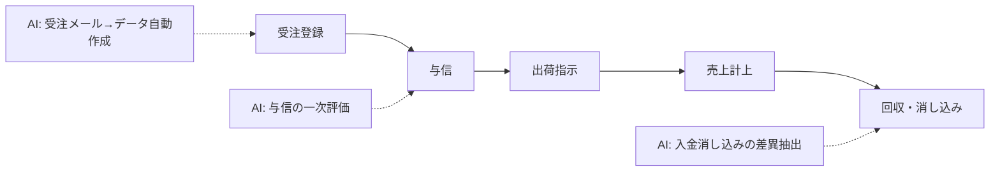

FDE の仕事は「AI を入れる」ことではなく、**「業務のどの工程に、どの成果指標で入るか」を決める**こと。その地図として、SAP をはじめ ERP ベンダーが数十年かけて文書化してきた業務プロセスの型を使う。顧客の業務をこの 6 分類に当てはめれば、As-Is の整理が速くなり、AI の入り方も標準的なパターンから選べる。

## 6 大プロセスと AI の接点

### 1. 販売（O2C: Order to Cash）

**フロー**: 受注登録 → 与信 → 出荷指示 → 売上計上 → 回収

| 項目 | 内容 |
|---|---|
| よくある痛み | 受注メールの手入力 / 与信判断の属人化 / 入金と請求の消し込み |
| AI の入り方 | 受注メール → 受注データの自動作成（文書処理）/ 与信チェックの一次評価 / 入金消し込みの差異抽出 / 営業日報からの商談分析 |
| 関連システム | S/4HANA SD、受注管理、CRM（Salesforce 等） |
| 成果指標の例 | 受注登録時間、消し込み残件数 |

### 2. 購買（P2P: Procure to Pay）

**フロー**: 購買依頼 → 見積比較 → 発注 → 受入 → 検収 → 支払

| 項目 | 内容 |
|---|---|
| よくある痛み | 請求書と発注・検収の突合（3-way matching）の手作業 / 購買申請の規程チェック / 価格の変動追従 |
| AI の入り方 | 請求書 OCR + 発注との突合 / 申請内容の規程引用チェック / 購買単価の変動アラート |
| 関連システム | S/4HANA MM、購買管理、楽楽購買 |
| 成果指標の例 | 突合残件数、支払処理リードタイム |

### 3. 在庫・倉庫

**フロー**: 入庫 → 保管 → ピッキング → 出庫 → 棚卸

| 項目 | 内容 |
|---|---|
| よくある痛み | 在庫差異の原因が分からない / 需要変動への発注 / ピッキングミス |
| AI の入り方 | 需要予測と発注量提案 / 棚卸差異の原因分類 / 異常在庫の検知（[物流の異常整理](/domains/logistics/use-cases/delivery-anomaly)と接続） |
| 関連システム | WMS、在庫管理、S/4HANA MM |
| 成果指標の例 | 棚卸差異率、欠品日数 |

### 4. 生産

**フロー**: 生産計画 → 資材手配（MRP）→ 製造 → 品質検査 → 完了入庫

| 項目 | 内容 |
|---|---|
| よくある痛み | 手配漏れ・納期遅延 / 不具合報告が自由記述 / 熟練技能の継承 |
| AI の入り方 | 生産計画のたたき台 / 不具合報告の構造化と傾向分析（[製造の不具合整理](/domains/manufacturing/use-cases/defect-report)）/ 作業手順書の生成（[手順書支援](/domains/manufacturing/use-cases/work-instruction)） |
| 関連システム | S/4HANA PP、MES、生産管理システム |
| 成果指標の例 | 計画達成率、不具合の再発件数 |

### 5. 経理・財務

**フロー**: 仕訳入力 → 請求・支払処理 → 月次締め → 決算 → 税務申告

| 項目 | 内容 |
|---|---|
| よくある痛み | 伝票入力 / 証憑と記帳の突合 / 月次資料の作成時間 |
| AI の入り方 | 請求書の AI 処理（freee・弥生が提供する機能の補完）/ 突合の一次分析 / [月次レポート](/domains/finance/use-cases/monthly-report)のドラフト / [規程 Q&A](/domains/finance/use-cases/policy-qa) |
| 関連システム | S/4HANA FI・CO、freee、弥生、楽楽精算 |
| 成果指標の例 | 月次締め日数、証憑突合の残件数 |

### 6. 人事労務

**フロー**: 採用 → 入社（オンボーディング）→ 勤怠 → 給与計算 → 評価 → 退職

| 項目 | 内容 |
|---|---|
| よくある痛み | 規程・手続きの問い合わせ対応 / 勤怠の締め催促 / 評価の事実整理 |
| AI の入り方 | 規程 Q&A ボット（引用付き）/ [面接メモの事実抽出](/domains/hr/use-cases/interview-notes) / [オンボーディング資料](/domains/hr/use-cases/onboarding-materials) / 勤怠エラーの事前検知 |
| 関連システム | HCM（SAP SuccessFactors 等）、勤怠 SaaS（KING OF TIME 等）、給与ソフト |
| 成果指標の例 | 問い合わせ対応時間、締め処理の残件数 |

## FDE の進め方: この分解を現場で使う

1. **As-Is を書く**: 顧客の業務を 6 分類に当てはめ、プロセスごとに「工程 / 担当 / システム / 所要時間」を表にする（ヒアリングは [STEP 1](/guide/step-1-pick-a-task) の型）
2. **痛みに成果指標を紐づける**: 「入金消し込み 月 20 時間 → 半分」のように、減らす対象を数値で
3. **AI の入り方を型から選ぶ**: ①文書処理（OCR + 抽出）②生成（ドラフト）③分類（構造化）④予測 ⑤対話（引用付き Q&A）。ほとんどの業務改善はこの 5 型の組合せ
4. **連携方式を決める**: [クラウド別サービスマップ](/references/cloud-ai-services) の選択順（API > CSV バッチ > RPA）
5. **対象を 1 プロセスに絞って PoC → 本番 → 定着**（[工程](/process)の型で回す）

## 参照すべき既存ドキュメント

業務の As-Is 理解はゼロから聞かない。ベンダーが公開している業務プロセス資料が最速の教材になる:

- **SAP**: S/4HANA の業務プロセス一覧（SD / MM / FI・CO / PP）、業界別ベストプラクティス、SAP Business AI / Joule の機能カタログ
- **国産クラウド ERP / SaaS**: freee・弥生の業務マニュアル、楽楽シリーズ（精算・購買・契約）の業務カタログ、kintone のアプリテンプレート集
- **RPA ベンダー**: UiPath / WinActor の業務シナリオ集（「手作業で回っている業務」の実態が分かる）

これらの資料にある「標準フロー」と顧客の「実際」の差分こそが、FDE の聞くべき質問リストになる。
