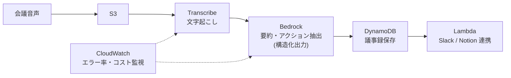
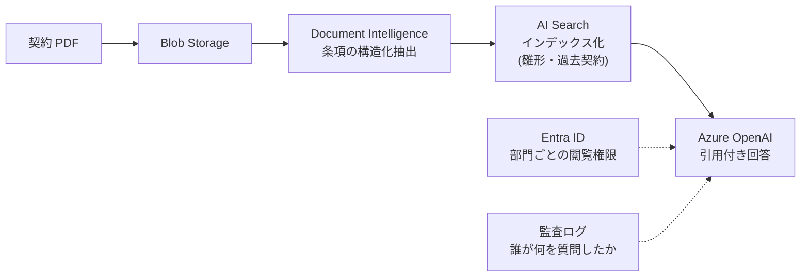

FDE の現場で最初にぶつかる壁が「顧客は AWS / Azure / GCP のどれかを既に持っている」こと。**新しいクラウドを持ち込むのではなく、顧客の既存環境のサービスで構成する**のが鉄則。このページは「この業務に AI を入れるとき、各クラウドで何を使うか」の対応表と参照構成です。

## 基本原則

1. **顧客の既存クラウドに寄せる**: 契約・権限・監査・ネットワークが既にある。新規クラウドの持ち込みは例外の理由が必要
2. **データの流出範囲を最初に確認**: プロンプトや文書がモデル提供元の学習に使われるか。Bedrock / Azure OpenAI / Vertex AI は契約上「学習に使わない」設定が可能（一般のチャット UI は不可）
3. **マネージド RAG から始める**: 自前のベクトル基盤を作る前に、Bedrock Knowledge Bases / Azure AI Search / Vertex AI Search で PoC する。カスタマイズは後
4. **エンタープライズ要件**: SSO（IAM Identity Center / Entra ID）、監査ログ、VPC 内完結（PrivateLink / VNet 統合）を設計に含める

## シナリオ別サービス対応表

| シナリオ | AWS | Azure | GCP |
|---|---|---|---|
| LLM 呼び出し | Bedrock（Claude / Titan など） | Azure OpenAI（GPT-4o 等） | Vertex AI（Gemini） |
| RAG（社内文書検索付き回答） | Bedrock Knowledge Bases / OpenSearch | Azure AI Search + Azure OpenAI | Vertex AI Search / Agent Builder |
| 音声 → テキスト | Amazon Transcribe | Azure AI Speech | Cloud Speech-to-Text |
| 帳票・OCR・文書抽出 | Amazon Textract | Azure AI Document Intelligence | Document AI |
| AI エージェント | Bedrock Agents / Amazon Q Business | Copilot Studio / Azure AI Agent Service | Vertex AI Agent Builder |
| 画像認識 | Rekognition | Azure AI Vision | Cloud Vision API |
| ワークフロー / 連携 | Lambda + Step Functions / EventBridge | Logic Apps / Functions | Workflows / Cloud Run |
| 認証・権限 | IAM / IAM Identity Center | Entra ID | IAM / Cloud Identity |
| 監視・運用 | CloudWatch | Azure Monitor | Cloud Monitoring |
| データ基盤 | S3 / Athena / Redshift | Blob Storage / Synapse / Fabric | Cloud Storage / BigQuery |

## 参照アーキテクチャ例

### 例 1: 議事録システム（AWS）

- コスト目安: Transcribe 約 $0.024/分 + Bedrock トークン課金。月額上限は Budgets で設定
- FDE の設計ポイント: 文字起こしの話者分離が荒い前提で UI を作る / Bedrock の出力は JSON モード + スキーマ検証

### 例 2: 契約レビュー支援（Azure）

- FDE の設計ポイント: PDF のスキャン品質に応じて OCR 前処理 / 引用（条項番号）の実在突合をパイプラインに組み込む / 機密契約は VNet 内完結構成

## SAP 環境との連携

| 項目 | 内容 |
|---|---|
| SAP Business AI / Joule | S/4HANA 組み込みの AI アシスタント。まず顧客の契約範囲を確認（すでに使える機能がある） |
| 業務モジュール | SD（販売）/ MM（購買在庫）/ FI・CO（経理）/ PP（生産）——AI の入り方は [業務プロセスの接点](/references/business-processes) と対応づく |
| 連携方式 | BTP Integration Suite / OData API / ABAP SDK。レガシーは IDoc・CSV・RPA |
| カスタム AI | SAP AI Core / AI Launchpad で BTP 上に AI をデプロイし、S/4HANA の業務データと接続 |

FDE の注意: SAP の案件では「AI を新規で作る」より **SAP が提供する AI 機能の有効化 + 足りない部分の BTP 拡張**が正解になることが多い。

## 国産 SaaS / ERP との連携

| 対象 | 連携の要点 |
|---|---|
| kintone（サイボウズ） | REST API + プラグイン。AI チェック（申請の書き方、重複検知）を kintone 側のフローに組み込む |
| freee / 弥生（会計） | 請求書 AI 処理・仕訳自動化が既にある。FDE は「足りない業務」（突合・例外処理・証憑管理）を補う |
| 楽楽精算 / 楽楽購買 | 申請承認フロー。AI による申請内容チェック・規程引用をワークフローの分岐に組み込む |
| 勤怠（KING OF TIME 等） | 勤怠エラーの検知・申請案内ボット |
| 受託基幹システム | API が無ければ CSV バッチ → それも無ければ RPA（UiPath / WinActor）。**RPA は最後の手段**（壊れやすい） |

連携方式の選択順: **API（リアルタイム） > CSV バッチ（日次で足りるなら） > RPA（画面しかない時の最終手段）**。

## FDE の進め方

1. 顧客クラウドの棚卸し（契約中サービス・権限・ネットワーク制約・データの所在）
2. シナリオを上の対応表に当てはめ、**既存サービス最優先**で構成案を作る
3. PoC はマネージド AI（Knowledge Bases / AI Search / Vertex AI Search）で 1〜2 週間
4. 効果が出たら非機能（精度・コスト・権限・監査）を詰めて本番化
5. SAP / ERP 連携は業務プロセス単位で（[業務プロセスと AI の接点](/references/business-processes) 参照）
