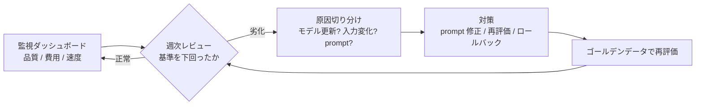

生成 AI アプリは**確率的な出力を返すシステム**です。コードを変えていなくても、モデル側の更新で品質が変わる——従来の運用（監視 → 障害対応）に加えて、「品質の継続測定と再生」が必要になります。このページは運用工程の型を示します（評価の詳細は [Evaluation](/patterns/evaluation) パターン）。

## 従来運用との差分

| 観点 | 従来システム | 生成 AI アプリ |
|---|---|---|
| 出力 | 決定的（同じ入力 → 同じ出力） | 確率的（同じ入力でも揺れる） |
| 変更 | 自分のデプロイだけ | **モデル側の更新で品質が変わる** |
| テスト | パス/フェイル | スコアと閾値（ゴールデンデータ照合） |
| 障害 | 落ちる/例外 | **静かな品質劣化**（落ちないのが怖い） |

## 運用の型（週次ルーティン）

### 監視すべき 4 系統の指標

| 系統 | 指標例 | 劣化のサイン |
|---|---|---|
| **品質** | 採用率（ユーザーが修正した割合）、引用実在率、judge スコア | 採用率が週次で連続下落 |
| **費用** | 1 リクエスト トークン数、1 日コスト | 同じ入力量でコストが急増 |
| **速度** | レイテンシ p50 / p95 | p95 が基準の 1.5 倍超 |
| **安定性** | エラー率、タイムアウト、レート制限ヒット | 断続的な 429/5xx |

- 品質の測定方法は [Evaluation](/patterns/evaluation)（ゴールデンデータ + judge ルーブリック）を運用に組み込む
- 採用率の計測には [Human-in-the-loop](/patterns/human-in-the-loop) の承認記録を使う

## モデル更新への備え

モデル提供元は常に更新を行い、**同じ prompt でも出力の傾向が変わります**。プロンプトやモデル変更時は必ず再評価を（[Evaluation](/patterns/evaluation) の自動化を参照）。

- バージョン固定（例: `claude-sonnet-4-5` のように日付付きスナップショットを指定）で影響をコントロール
- 更新が強制される場合は、ゴールデンデータ 20 件で再評価してから本番へ

## prompt・設定のバージョン管理

prompt はコードと同じ扱いにします（[STEP 3](/guide/step-3-build-the-loop) の「型」として保存）:

- prompt ファイルは Git で管理（誰が・いつ・何を変えたか）
- 変更 = リリース扱い。変更したら再評価 → 合格 → デプロイの順
- ロールバックできる状態（前バージョンの prompt を常に保持）

## 週次レビューの合格基準（受け入れ基準の型）

- [ ] 品質指標が週次で連続下落していない
- [ ] コストが予算内（1 リクエストあたりの上限設定）
- [ ] エラー率・レイテンシが基準内
- [ ] 変更（prompt / モデル / データ）があれば再評価を通過している

## 関連

- [Evaluation](/patterns/evaluation) / [Self-check](/patterns/self-check) / [Human-in-the-loop](/patterns/human-in-the-loop)
- [運用・改善（waterfall）](/process/waterfall/maintenance) / [運用（agile）](/process/agile/daily-scrum)
- [STEP 4](/guide/step-4-acceptance) — 監視の受け入れ基準の作り方
