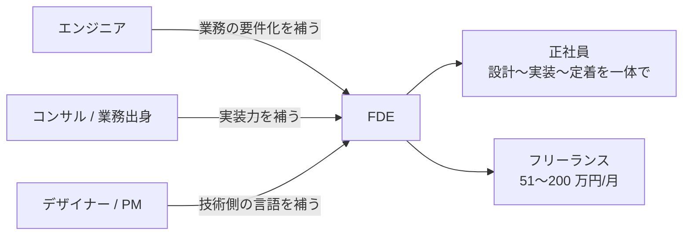

FDE は新しい職種のため、統計が揃っていない。だから市場を見るときは「肩書き」ではなく**案件の中身**で追う必要がある。このページは 2026 年 9 月時点の調査メモ。数字は各ソースの記載をそのまま転記したものです。

## 結論から

### 主要サイトの FDE 案件数（2026-09-13 時点の直接確認）

| サイト | FDE 案件数 | 単価データ | ソース |
|---|---|---|---|
| フリーランススタート | **147 件** | 51〜200 万円/月、リモート 73 件 | [FDE(Forward Deployed Engineer)の案件一覧](https://freelance-start.com/jobs/job_category-47) |
| フリーランスボード | **106 件** | **平均 108.1 万円/月**（サイト公表値、年収想定 1,298 万円）、掲載レンジ 65〜165 万円 | [FDEのフリーランス案件一覧](https://freelance-board.com/jobs/fde) |
| レバテックフリーランス | 掲載あり（要認証のため件数未計上） | 複数案件を確認（80〜165 万円レンジの提供元として頻出） | [FDE 案件一覧](https://freelance.levtech.jp/word/list/150732/) |
| ココナラテック / Indieverse 等 | 掲載あり（件数未取得） | — | 各サイトの FDE 一覧ページ |

- **フリーランススタート（国内主要案件検索サイト）に FDE 案件が 147 件**。単価は **51〜200 万円/月**。200 万円クラスは「AI/IT/DX 領域のコンサルティング + 導入経験 3 年以上」
- 案件の業界は多様: **製造、医療・ヘルスケア、不動産・FinTech、エネルギー、化学品商社、建設、デジタルマーケティング**など。「各領域の業務に AI を入れる」仕事そのもの
- 必須スキルに共通して現れるのは: **①業務の整理と要件・成果指標への落とし込み ②本番リリースから現場定着までの推進 ③AI コーディングツール（Claude Code / Cursor / Copilot）④LangChain / LangGraph / RAG / Dify ⑤AI の非機能要件（精度・セキュリティ・性能・コスト）**
- 海外では Palantir モデルとして確立され、OpenAI・Anthropic も採用。紹介記事では年棒最高 22 万ドルとされる

## 就業形態とキャリアの入り口

| 就業形態 | 特徴 | 向いている人 |
|---|---|---|
| **正社員（AI 導入部門・SIer・AI スタートアップ）** | 大規模案件、チームでの学び、安定 | 実務経験を積みながら FDE 型を身につけたい人 |
| **フリーランス（案件単位）** | 単価 51〜200 万円/月。複数業界を横断できる | 業務と技術を両方語れる人。営業・提案力も必要 |
| **複業・社内 FDE** | 自社の業務に AI を導入する社内役割 | まず身の回りの業務で実績を作りたい人 |

キャリアの入り口は 3 つ。どれも「もう一方の言語」を補うのが共通のスタートです。

## 案件の実例（フリーランススタート、2026-09 確認）

| 業界・内容 | 単価 | 求められること（抜粋） |
|---|---|---|
| 企業向け AI 変革支援（Deployment Strategist） | 112 万円 | 業務部門と業務を整理し要件・成果指標へ落とし込む / 企画〜本番リリース・現場定着まで主体推進 / 生成 AI を日常業務で活用 |
| 製造業の生成 AI 活用 FDE 支援 | 102 万円 | 生成 AI 設計の知見 / 非機能要件（精度・セキュリティ・性能・コスト）の知見 |
| 医療・ヘルスケア領域の AI 変革支援 | 112 万円 | 上記に加え技術理解（データ構造・API・連携） |
| 不動産・FinTech の社内業務改革 | 160 万円 | LLM 実装知識 / 簡単なツール構築 / 現場への分かりやすい説明力 |
| AI エージェント導入支援 | 51 万円 | LangGraph 等のオーケストレーション理解 / 監視・ログで劣化を早期検知 |
| システム更改の AI 利活用企画構想 | 180 万円 | 上流での構想策定 / AI 活用プロトタイプを提示しながら顧客と要件化 |
| 生成 AI 活用の AX 推進（コンサル） | **200 万円** | 顧客折衝 3 年以上 / ステークホルダーとの合意形成 / 複数関係者を巻き込んだ推進 |

## 需要が生まれている理由

1. **AI は「買って終わり」にならない**: 各社の業務フロー・データ・合规要件が違い、そのままでは使えない。現場に入って繋ぐ人間が必須
2. **通常エンジニアは業務を知らず、業務側は AI を知らない**: この断絶を埋める専業の需要が、案件数として顕在化した
3. **PoC から本番・定着までの一遍通白血**が求められ、分業体制だと遅い・伝わらない
4. **AI コーディングツールの実務活用**が必須スキルに載り始めた（「AI 駆動開発」「AI-DLC」という語も出現）

## 身につけるべきスキル（案件必須スキルの頻出セット）

| 領域 | 具体例 |
|---|---|
| 業務の要件化 | As-Is / To-Be 設計、曖昧な要求の構造化、成果指標の設定 |
| AI 実装 | LLM アプリ開発、LangChain / LangGraph、RAG、Dify、プロンプト設計 |
| 開発基盤 | Python / TypeScript、AWS / GCP / Azure、クラウドでの開発・運用 |
| FDE ツール | Claude Code / Cursor / Copilot など AI コーディングツールの実務活用 |
| 非機能 | 精度・セキュリティ・性能・コストの設計と評価 |
| 定着 | 現場への説明力、本番稼働後の利用定着までの推進 |

## 情報ソースと注意

- 主要ソース: フリーランススタート（FDE 案件一覧、147 件、2026-09 確認）/ Figma 2026 AI Report / Vercel / 各採用ページ
- 海外の年棒数字（最高 22 万ドル等）は紹介記事の最大値。勤務地・現場条件が付く
- 数字は 2026-09 時点。使うときは最新の案件一覧・採用ページで再確認を
