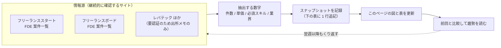
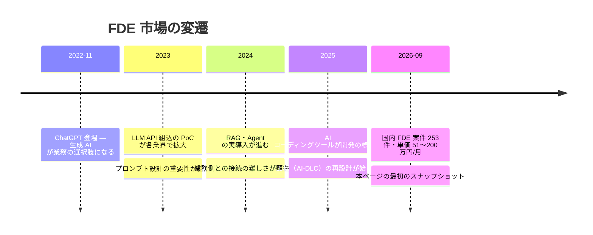
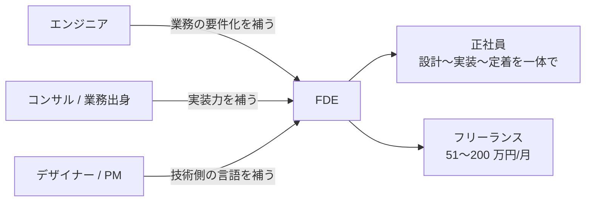
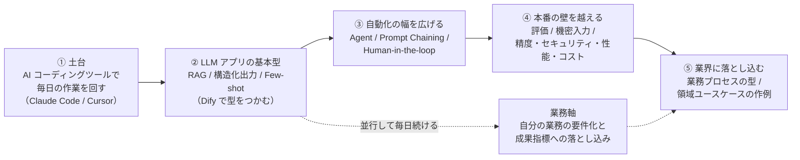
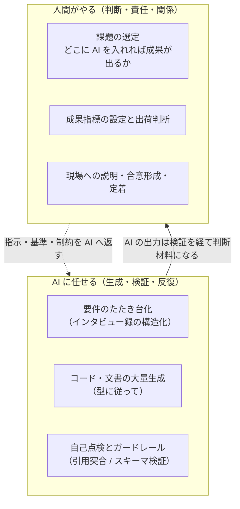

FDE は新しい職種のため、公的統計が揃っていない。だから市場を見るときは「肩書き」ではなく**案件の中身**で追う。このページは、主要招聘サイトの案件を**決まった手順で繰り返し調査し、スナップショットとして蓄える**ことで、一度きりの調査ではなく**趨勢を読めるようにする**ためのものです。

## 1. 調査の仕組み（情報源とパイプライン）

### 主要サイトの FDE 案件数（2026-09-13 時点の直接確認）

| サイト | FDE 案件数 | 単価データ | ソース |
|---|---|---|---|
| フリーランススタート | **150 件**（2026-09-19 ブラウザ自動取得） | 51〜200 万円/月、リモート 73 件 | [FDE(Forward Deployed Engineer)の案件一覧](https://freelance-start.com/jobs/job_category-47) |
| フリーランスボード | **106 件** | **平均 108.1 万円/月**（サイト公表値、年収想定 1,298 万円）、掲載レンジ 65〜165 万円 | [FDEのフリーランス案件一覧](https://freelance-board.com/jobs/fde) |
| レバテックフリーランス | **13 件**（キーワード一覧の公表件数、2026-09-19 自動取得） | 複数案件を確認（80〜165 万円レンジの提供元として頻出） | [FDE 案件一覧](https://freelance.levtech.jp/word/list/150732/) |
| ココナラテック / Indieverse 等 | 掲載あり（件数未取得） | — | 各サイトの FDE 一覧ページ |

### スナップショット記録（調査のたびに 1 行追記する）

| 調査日 | 総案件数 | 単価レンジ | 主な変化・気づき |
|---|---|---|---|
| 2026-09-13 | 253 件（2 サイト計） | 51〜200 万円/月 | 最初の記録。業界は製造・医療・FinTech・エネルギー・建設・マーケ等と多様。200 万円クラスは「コンサルティング + 導入経験 3 年以上」 |
| 2026-09-19 | 274 件（自動 3 ソース計：スタート 150 + ボード 111 + レバテック 13） | ボード単価サンプル中央値 160 万円 | 週次バッチ初回。スタートはヘッドレスブラウザで自動取得（手動不要） |

## 2. タイムライン — 市場はどう動いてきたか

- 上 4 行は公開情報からの概観。**2026-09 以降の行は、スナップショット記録を積むたびに追記する**
- 見るべきポイントは 3 つ。**案件数の伸び**（需要の絶対量）、**単価レンジの広がり**（上流工程まで担える人へのプレミアム）、**必須スキルの変化**（次の節の学習パスを更新するシグナル）

## 3. 現在の需要（最新スナップショット）

### 結論から

- **フリーランススタート（国内主要案件検索サイト）に FDE 案件が 147 件**。単価は **51〜200 万円/月**。200 万円クラスは「AI/IT/DX 領域のコンサルティング + 導入経験 3 年以上」
- 案件の業界は多様。**製造、医療・ヘルスケア、不動産・FinTech、エネルギー、化学品商社、建設、デジタルマーケティング**など、「各領域の業務に AI を入れる」仕事そのもの
- 海外では Palantir モデルとして確立され、OpenAI・Anthropic も採用。紹介記事では年棒最高 22 万ドルとされる

### 案件の実例（フリーランススタート、2026-09 確認）

| 業界・内容 | 単価 | 求められること（抜粋） |
|---|---|---|
| 企業向け AI 変革支援（Deployment Strategist） | 112 万円 | 業務部門と業務を整理し要件・成果指標へ落とし込む / 企画〜本番リリース・現場定着まで主体推進 / 生成 AI を日常業務で活用 |
| 製造業の生成 AI 活用 FDE 支援 | 102 万円 | 生成 AI 設計の知見 / 非機能要件（精度・セキュリティ・性能・コスト）の知見 |
| 医療・ヘルスケア領域の AI 変革支援 | 112 万円 | 上記に加え技術理解（データ構造・API・連携） |
| 不動産・FinTech の社内業務改革 | 160 万円 | LLM 実装知識 / 簡単なツール構築 / 現場への分かりやすい説明力 |
| AI エージェント導入支援 | 51 万円 | LangGraph 等のオーケストレーション理解 / 監視・ログで劣化を早期検知 |
| システム更改の AI 利活用企画構想 | 180 万円 | 上流での構想策定 / AI 活用プロトタイプを提示しながら顧客と要件化 |
| 生成 AI 活用の AX 推進（コンサル） | **200 万円** | 顧客折衝 3 年以上 / ステークホルダーとの合意形成 / 複数関係者を巻き込んだ推進 |

### 就業形態とキャリアの入り口

| 就業形態 | 特徴 | 向いている人 |
|---|---|---|
| **正社員（AI 導入部門・SIer・AI スタートアップ）** | 大規模案件、チームでの学び、安定 | 実務経験を積みながら FDE 型を身につけたい人 |
| **フリーランス（案件単位）** | 単価 51〜200 万円/月。複数業界を横断できる | 業務と技術を両方語れる人。営業・提案力も必要 |
| **複業・社内 FDE** | 自社の業務に AI を導入する社内役割 | まず身の回りの業務で実績を作りたい人 |

### 需要が生まれている理由

1. **AI は「買って終わり」にならない**: 各社の業務フロー・データ・合规要件が違い、そのままでは使えない。現場に入って繋ぐ人間が必須
2. **通常エンジニアは業務を知らず、業務側は AI を知らない**: この断絶を埋める専業の需要が、案件数として顕在化した
3. **PoC から本番・定着までの一気通貫**が求められ、分業体制だと遅い・伝わらない
4. **AI コーディングツールの実務活用**が必須スキルに載り始めた（「AI 駆動開発」「AI-DLC」という語も出現）

## 4. 技術スタック → 学習パス（どう学ぶか）

案件文に繰り返し現れる技術スタックは 5 群に整理できる。学ぶ順序は、**案件の必須度が高いもの・他の土台になるものから**。

| ステップ | この KB の対応ページ |
|---|---|
| ① 土台 | [STEP 3: 作業ループ](/guide/step-3-build-the-loop) / [小技集](/references/prompt-tips) |
| ② 基本型 | [RAG](/patterns/rag) / [構造化出力](/patterns/structured-output) / [Few-shot](/patterns/few-shot) |
| ③ 自動化 | [Agent](/patterns/agent) / [Prompt Chaining](/patterns/prompt-chaining) / [Human-in-the-loop](/patterns/human-in-the-loop) |
| ④ 本番の壁 | [Evaluation](/patterns/evaluation) / [Confidential Inputs](/patterns/confidential-inputs) / [コスト見積](/references/cost-estimate) |
| ⑤ 業界へ | [業務プロセスと AI の接点](/references/business-processes) / [領域](/domains)のユースケース |
| 業務軸 | [STEP 1: 題材を選ぶ](/guide/step-1-pick-a-task) / [要件定義](/process/waterfall/requirements) |

- AI 軸（①〜⑤）と業務軸は**並行**が原則。AI だけ触っていると「使えるが入る場所がない」人になり、業務だけだと「入る場所はあるが作れない」人になる
- 次のスナップショットで必須スキルの頻度が変わったら、この図の順序と KB リンクを見直す

## 5. AI の境界 — AI に任せること / 人間がやること

案件文が求めているのは「AI を使いこなす力」と「AI に任せない判断」のセット。境界は次のように引く。

| | AI が得意 | 人間が必須 |
|---|---|---|
| 情報 | 文書の検索・要約・突合（[RAG](/patterns/rag)） | 何が正しい情報かの最終判断 |
| 生成 | たたき台の大量生成（[Few-shot](/patterns/few-shot)） | 採否と責任の引き受け |
| 検証 | 形式・引用の機械チェック（[Evaluation](/patterns/evaluation)） | 「正しいこと」の定義（受け入れ基準） |
| 関係 | 説明資料の下書き | 顧客・現場との合意形成と信頼 |

- 境界の設計方法そのものは [Human-in-the-loop](/patterns/human-in-the-loop)、判断の線引きは [STEP 2](/guide/step-2-define-roles)、入力の安全側は [Confidential Inputs](/patterns/confidential-inputs) を参照
- **AI の境界は固定ではない**。ツールの精度が上がれば「検証」は AI 側へ寄せられる。ただし「選定・指標・責任」は案件文が示すかぎり、常に人間側に残る

## 6. 大手 IT ベンダーの動向

FDE の協働・競合相手となる大手 SIer・コンサルの生成 AI 推進状況は、
[ベンダー動向](/vendors)タブで追跡しています。

## 7. 実戦テクニックと実演記録

実際の案件で効いた工夫は、[実戦テクニック](/references/field-tips)のページに逐次追記していく。理論（工程 × 人間と AI の分業）を実コードで検証した記録は、[実演記録 — OSS で新機能追加とバグ対応をやってみる](/references/oss-experiment)を参照。

## 情報ソースと注意

- 主要ソース: フリーランススタート（FDE 案件一覧、147 件、2026-09 確認）/ フリーランスボード（106 件、平均単価公表値）/ レバテックフリーランス（要認証）/ Figma 2026 AI Report / Vercel / 各採用ページ
- 海外の年棒数字（最高 22 万ドル等）は紹介記事の最大値。勤務地・現場条件が付く
- 数字は 2026-09 時点。使うときは最新の案件一覧・採用ページで再確認を
