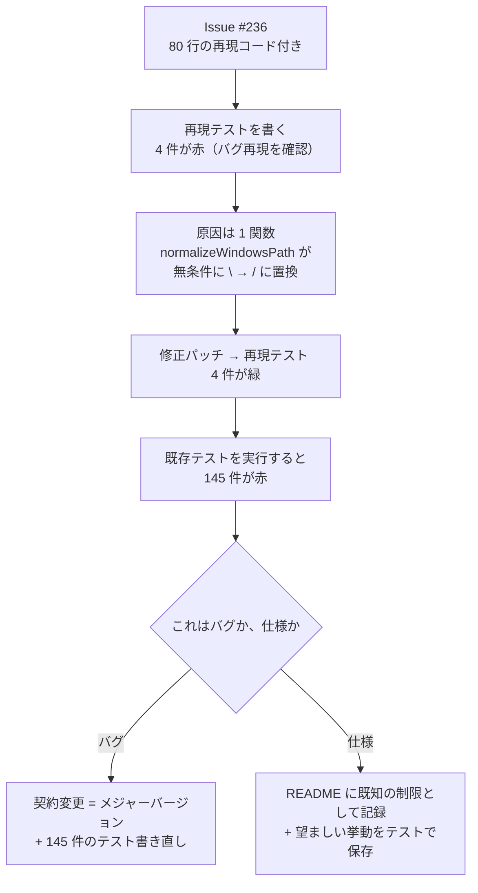
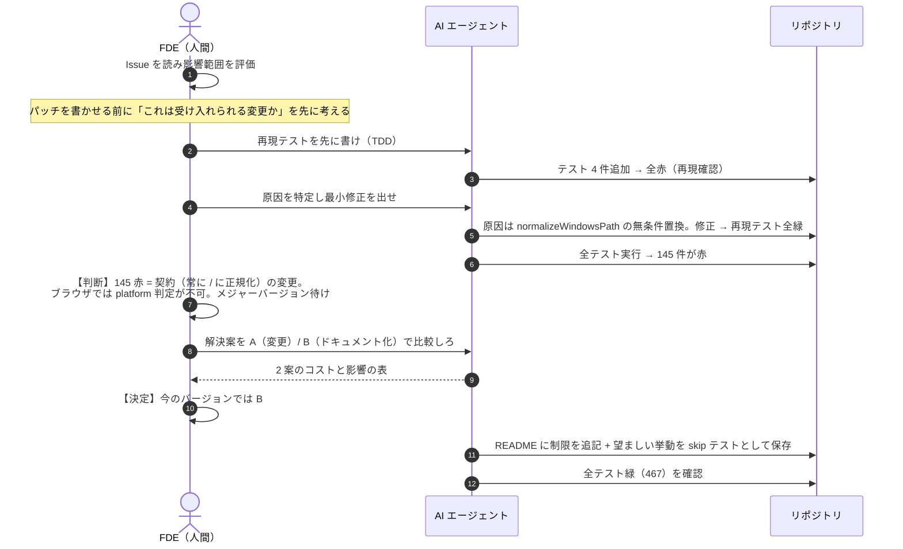
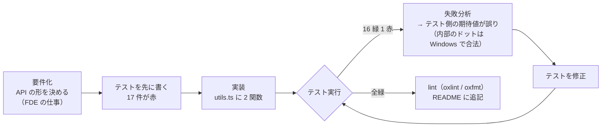
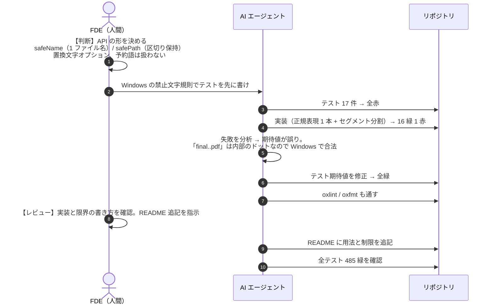
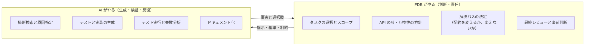

この KB の理論（[工程](/process)の人間 × AI 分業）は、実際のコード変更で成立するのか。小さな OSS リポジトリ **unjs/pathe**（Node の `path` モジュールの代替ユーティリティ。テスト 467 本が全自動で回る）で、**バグ対応**と**新機能追加**を 1 回ずつ実際にやってみた記録です。

- **タスク A（バグ対応）**: Issue #236「POSIX 上でも `\` が `/` に置き換えられ、`\` を含む正しいファイル名が壊れる」
- **タスク B（機能追加）**: Issue #47「Windows で安全なファイル名・パスを作る `safeName` / `safePath` ユーティリティがほしい」

## プロセス 1: バグ対応（#236）

### 何が起きたか

### 役割分担（シーケンス図）

### 学び: バグ対応の本命は「コード」ではなく「判断」

AI は 15 分で「再現テスト + 修正パッチ + 失敗リスト」まで到達した。しかし最後の分岐——**145 件の赤をどう解釈するか**——は AI には決められない:

| | 案 A: 挙動を変える | 案 B: 仕様として記録（採用） |
|---|---|---|
| コード | `normalizeWindowsPath` を platform 判定で分岐 | 変更なし |
| テスト | 145 件の契約テストを書き直し（メジャー バージョン） | 再現テストを skip で保存（仕様として） |
| 利用者への影響 | Windows 形式の文字列を POSIX で処理している全コードが壊れる | `\` を含むファイル名を扱う人は README を見て回避 |
| 判断の根拠 | pathe の前提「常に POSIX 形式」を変えるという宣言が必要 | Issue 報告者自身も「確認と文書化」を求めていた |

パッチ自体はブランチ `fix/236-posix-backslash` に保存した。**メンテナーが方針を決めた日は、そこから 30 分で出荷できる**。これが AI 時代のバグ対応の形。

## プロセス 2: 新機能追加（#47 `safeName` / `safePath`）

### 進め方（テスト先行）

### 役割分担（シーケンス図）

### 学び: 機能追加の質は「要件化の精度」で決まる

- API の形（関数名・引数・どこまで面倒を見るか）は **FDE が先に決めた**。ここが曖昧だと AI は別の形のものを作り、手戻りになる
- 面白いのはテスト 1 件の失敗。**実装ではなくテストの期待値が誤り**だった（`final..pdf` は Windows で合法）。生成物の検証は AI の仕事だが、「どちらが正しいか」の裁定に業務知識（Windows のファイル名規則）が必要だった
- テスト 17 本 → 実装 ~20 行。テスト先行なので実装の正しさを議論する必要がなかった

## 2 つのプロセスに共通する分業構造

| AI が速かった | FDE が必須だった |
|---|---|
| 既存コードの読み込みと原因特定（1 関数に絞り込み） | 「それはバグか仕様か」の裁定 |
| テスト・実装・README の生成（分単位） | API の形とスコープの決定 |
| テスト実行 → 失敗リスト → 差し戻しの反復 | 145 件の赤の解釈とメジャー/マイナーの判断 |
| 2 案の比較表の下書き | 案の選択と責任の引き受け |

## V モデルとの対応

[工程の V モデル](/process)に当てはめると、この実験は 1 回の小型 V サイクルだった:

| V の位置 | この実験での実体 |
|---|---|
| 要件定義 | Issue（#236 / #47）の受入基準を読む。API の形を決める |
| 設計 | 修正方針（platform 分岐 or ドキュメント化）・関数シグネチャ |
| 実装 | AI が生成（正規表現 1 本、2 関数） |
| UT | 追加テスト（4 本 / 17 本）が即対応 |
| 結合テスト | リポジトリ全体のテストスイート（467 本）——ここで契約違反が露見した |
| UAT | FDE が Issue の受入基準に照らして最終判断 |

## 再現手順

実験の成果物は GitHub フォーク **[zixuniaowu/pathe](https://github.com/zixuniaowu/pathe)** の 3 ブランチに公開済み（ローカルにも `~/dev/oss-lab/pathe` として同期）:

- [`fix/236-posix-backslash`](https://github.com/zixuniaowu/pathe/tree/fix/236-posix-backslash) — 案 A のパッチ（再現テスト 4 本が緑、契約テスト 145 本が赤になる状態）
- [`docs/236-known-limitation`](https://github.com/zixuniaowu/pathe/tree/docs/236-known-limitation) — 案 B（採用）。README に制限を記録、望ましい挙動を skip テストで保存
- [`feat/47-safe-name-path`](https://github.com/zixuniaowu/pathe/tree/feat/47-safe-name-path) — `safeName` / `safePath` + テスト 20 本 + README 追記

ブランチごとの検証状態（2026-09-17 再検証済み）:

| ブランチ | テスト結果 | 検証コマンド |
|---|---|---|
| `fix/236-posix-backslash` | 再現テスト 4/4 緑 | `npx vitest run test/posix-backslash.spec.ts` |
| `docs/236-known-limitation` | 467 緑 + skip 12 | `npx vitest run` |
| `feat/47-safe-name-path` | 485 緑 + skip 12 | `npx vitest run && npx oxlint .` |

数値で見る変化: テスト 467 → 485（緑）。途中状態は「赤 4（再現）→ パッチ → 赤 145（契約）→ 方針決定 → 緑」。

実戦で効いた小技は[実戦テクニック](/references/field-tips)に追記していく。検証パターンの詳細は [Evaluation](/patterns/evaluation)、レビュー前の自己点検は [Self-check](/patterns/self-check) を参照。
